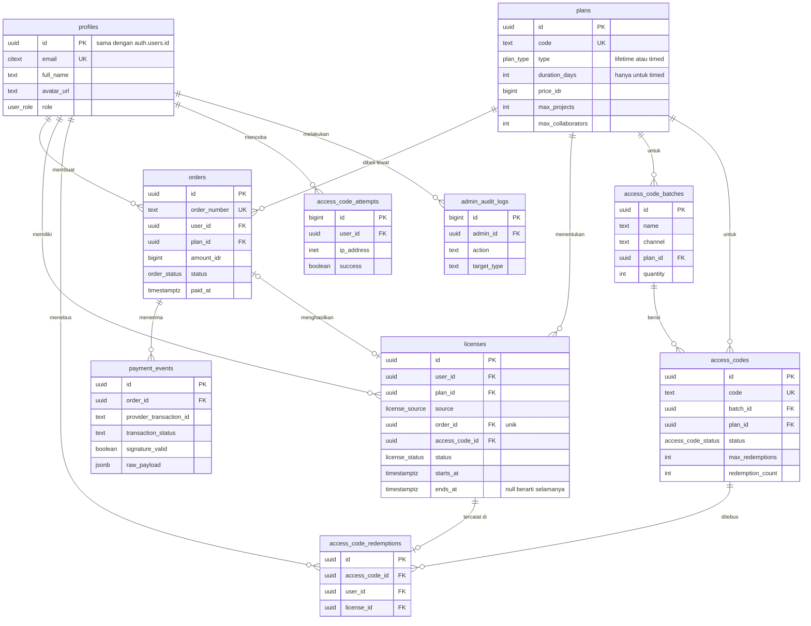
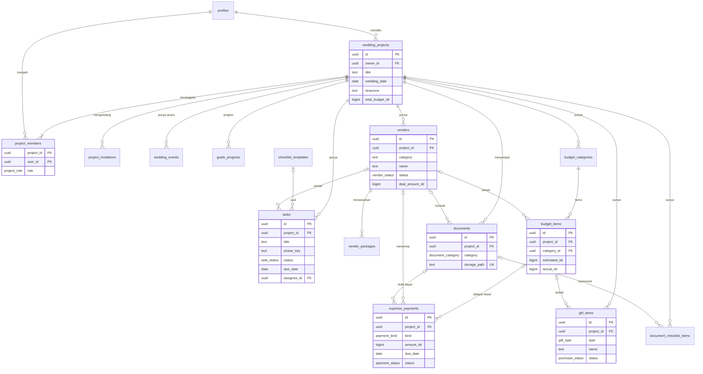
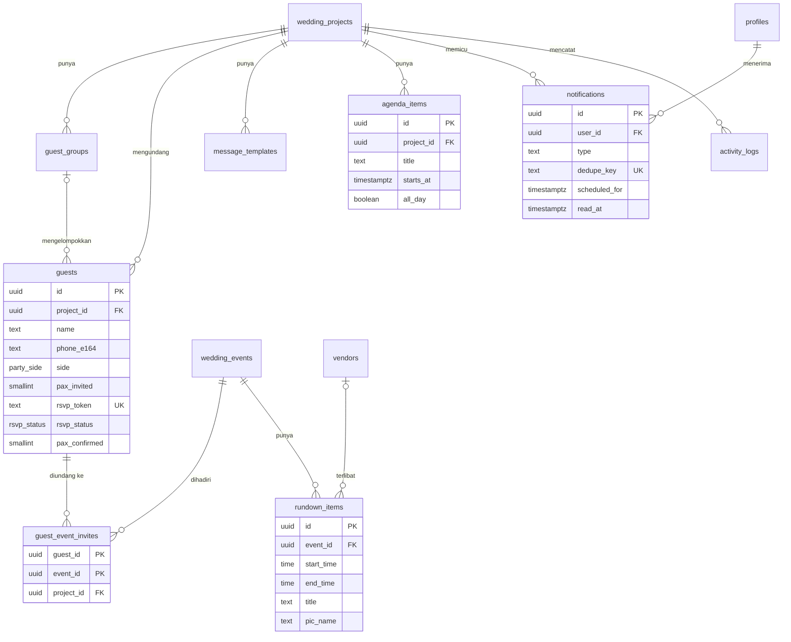

# ERD Monaplan

Skema database untuk Supabase (PostgreSQL 15+). Dokumen ini berisi diagram relasi, DDL lengkap, fungsi akses, Row Level Security, view, storage, dan seed. Seluruh SQL bisa dipecah menjadi file migrasi di `supabase/migrations/`.

---

## 0. Konvensi

- Nama tabel dan kolom `snake_case`, tabel dalam bentuk jamak.
- Primary key `uuid` dengan `gen_random_uuid()`, kecuali tabel log yang memakai `bigint identity`.
- Semua waktu `timestamptz` (UTC). Tanggal tanpa jam memakai `date`.
- **Uang disimpan sebagai `bigint` Rupiah tanpa desimal**, kolom diberi akhiran `_idr`.
- **Setiap tabel milik proyek wajib punya kolom `project_id`**, walaupun bisa diturunkan dari parent. Ini membuat policy RLS seragam dan cepat.
- `created_at` dan `updated_at` di semua tabel yang bisa diubah, `updated_at` diisi trigger.
- Enum PostgreSQL dipakai untuk status yang jarang berubah. Kategori yang mungkin bertambah (kategori vendor, kategori tugas) memakai `text`.

---

## 1. Ringkasan tabel

| Domain | Tabel | Fungsi |
|---|---|---|
| Akun dan akses | `profiles` | Profil user, terhubung 1:1 dengan `auth.users` |
| | `plans` | Paket yang dijual |
| | `orders` | Order pembelian via Midtrans |
| | `payment_events` | Log mentah notifikasi payment gateway |
| | `licenses` | Hak akses user, sumber kebenaran tunggal |
| | `access_code_batches` | Kelompok kode akses yang dibuat admin |
| | `access_codes` | Kode akses individual |
| | `access_code_redemptions` | Riwayat penebusan kode |
| | `access_code_attempts` | Log percobaan tebus kode untuk rate limit |
| | `admin_audit_logs` | Jejak aksi admin |
| Proyek | `wedding_projects` | Satu pernikahan (ruang kerja) |
| | `project_members` | Anggota proyek dan perannya |
| | `project_invitations` | Undangan kolaborator |
| | `wedding_events` | Acara: akad, resepsi, dan lainnya |
| | `guide_progress` | Progres Panduan Penggunaan |
| Perencanaan | `checklist_templates` | Template tugas global |
| | `tasks` | To Do Checklist |
| | `vendors`, `vendor_packages` | Kelola Vendor |
| | `budget_categories`, `budget_items` | Budgeting |
| | `expense_payments` | Jadwal dan realisasi pembayaran (DP, termin, pelunasan) |
| | `gift_items` | Mahar dan seserahan |
| | `documents` | Metadata file di Storage |
| | `document_checklist_items` | Checklist administrasi |
| Tamu dan hari H | `guest_groups`, `guests`, `guest_event_invites` | Tamu dan RSVP |
| | `message_templates` | Template pesan WhatsApp |
| | `rundown_items` | Rundown Hari H |
| Kalender dan sistem | `agenda_items` | Agenda dan reminder manual |
| | `notifications` | Notifikasi in-app dan email |
| | `activity_logs` | Riwayat aktivitas proyek |

---

## 2. Diagram

### 2.1 Akun, akses, dan pembayaran



### 2.2 Proyek dan perencanaan



### 2.3 Tamu, hari H, kalender, dan sistem



---

## 3. DDL

### 3.1 Ekstensi dan enum

```sql
create extension if not exists pgcrypto;
create extension if not exists citext;

create type public.user_role            as enum ('user', 'admin');
create type public.order_status         as enum ('pending', 'paid', 'failed', 'expired', 'cancelled', 'refunded');
create type public.license_source       as enum ('payment', 'access_code', 'admin_grant');
create type public.license_status       as enum ('active', 'revoked');
create type public.plan_type            as enum ('lifetime', 'timed');
create type public.access_code_status   as enum ('available', 'redeemed', 'revoked');
create type public.project_role         as enum ('owner', 'editor', 'viewer');
create type public.invitation_status    as enum ('pending', 'accepted', 'revoked', 'expired');
create type public.event_type           as enum ('lamaran', 'pengajian', 'siraman', 'akad', 'pemberkatan', 'resepsi', 'ngunduh_mantu', 'lainnya');
create type public.task_status          as enum ('todo', 'in_progress', 'done');
create type public.task_priority        as enum ('low', 'medium', 'high');
create type public.vendor_status        as enum ('prospek', 'survei', 'negosiasi', 'deal', 'batal');
create type public.payment_kind         as enum ('dp', 'termin', 'pelunasan', 'lainnya');
create type public.payment_status       as enum ('belum_bayar', 'sudah_bayar');
create type public.party_side           as enum ('pria', 'wanita', 'bersama');
create type public.rsvp_status          as enum ('belum_respon', 'hadir', 'tidak_hadir', 'ragu');
create type public.gift_type            as enum ('mahar', 'seserahan');
create type public.purchase_status      as enum ('rencana', 'dipesan', 'dibeli', 'diterima');
create type public.document_category    as enum ('identitas', 'administrasi_nikah', 'kontrak_vendor', 'bukti_pembayaran', 'lainnya');
create type public.notification_channel as enum ('in_app', 'email');

-- Token acak aman untuk URL (12 karakter, 72 bit)
create or replace function public.gen_url_token() returns text
language sql volatile as $$
  select translate(encode(gen_random_bytes(9), 'base64'), '+/', '-_');
$$;
```

### 3.2 Akun, akses, dan pembayaran

```sql
create table public.profiles (
  id                      uuid primary key references auth.users(id) on delete cascade,
  email                   citext not null unique,
  full_name               text,
  avatar_url              text,
  phone                   text,
  role                    public.user_role not null default 'user',
  last_active_project_id  uuid,                       -- FK ditambahkan setelah wedding_projects
  notify_email            boolean not null default true,
  created_at              timestamptz not null default now(),
  updated_at              timestamptz not null default now()
);

create table public.plans (
  id                 uuid primary key default gen_random_uuid(),
  code               text not null unique,            -- contoh: LIFETIME, TIMED_12M
  name               text not null,
  description        text,
  type               public.plan_type not null,
  duration_days      int,                             -- wajib untuk timed, kosong untuk lifetime
  price_idr          bigint not null check (price_idr >= 0),
  max_projects       int not null default 1 check (max_projects >= 1),
  max_collaborators  int not null default 3 check (max_collaborators >= 0),
  max_guests         int,                             -- null = tanpa batas
  storage_quota_mb   int not null default 500,
  is_public          boolean not null default true,   -- tampil di halaman aktivasi
  is_active          boolean not null default true,
  sort_order         int not null default 0,
  created_at         timestamptz not null default now(),
  updated_at         timestamptz not null default now(),
  check (
    (type = 'lifetime' and duration_days is null)
    or (type = 'timed' and duration_days > 0)
  )
);

create table public.orders (
  id                     uuid primary key default gen_random_uuid(),
  order_number           text not null unique,        -- MNP-YYYYMMDD-XXXXXX
  user_id                uuid references public.profiles(id) on delete set null,
  plan_id                uuid not null references public.plans(id),
  amount_idr             bigint not null check (amount_idr >= 0),
  status                 public.order_status not null default 'pending',
  provider               text not null default 'midtrans',
  provider_token         text,                        -- snap token
  provider_redirect_url  text,
  payment_method         text,                        -- qris, bank_transfer, gopay, credit_card, dst.
  needs_review           boolean not null default false,
  paid_at                timestamptz,
  expires_at             timestamptz not null,
  metadata               jsonb not null default '{}',
  created_at             timestamptz not null default now(),
  updated_at             timestamptz not null default now()
);

create table public.payment_events (
  id                       uuid primary key default gen_random_uuid(),
  order_id                 uuid references public.orders(id) on delete set null,
  provider                 text not null,
  provider_order_id        text not null,
  provider_transaction_id  text not null,
  transaction_status       text not null,
  fraud_status             text,
  payment_type             text,
  gross_amount             text,
  signature_valid          boolean not null,
  raw_payload              jsonb not null,
  processed_at             timestamptz,
  received_at              timestamptz not null default now(),
  unique (provider, provider_transaction_id, transaction_status)   -- idempotensi webhook
);

create table public.access_code_batches (
  id                        uuid primary key default gen_random_uuid(),
  name                      text not null,
  channel                   text not null default 'promo',   -- reseller, promo, bonus, offline, kompensasi
  plan_id                   uuid not null references public.plans(id),
  quantity                  int not null check (quantity between 1 and 10000),
  max_redemptions_per_code  int not null default 1 check (max_redemptions_per_code >= 1),
  valid_until               timestamptz,
  notes                     text,
  created_by                uuid references public.profiles(id) on delete set null,
  revoked_at                timestamptz,
  created_at                timestamptz not null default now()
);

create table public.access_codes (
  id                uuid primary key default gen_random_uuid(),
  code              text not null unique
                    check (code ~ '^MNP-[0-9A-HJKMNP-TV-Z]{4}-[0-9A-HJKMNP-TV-Z]{4}-[0-9A-HJKMNP-TV-Z]{4}$'),
  batch_id          uuid references public.access_code_batches(id) on delete cascade,
  plan_id           uuid not null references public.plans(id),
  status            public.access_code_status not null default 'available',
  max_redemptions   int not null default 1 check (max_redemptions >= 1),
  redemption_count  int not null default 0 check (redemption_count >= 0),
  valid_until       timestamptz,
  revoked_at        timestamptz,
  revoked_reason    text,
  created_at        timestamptz not null default now(),
  check (redemption_count <= max_redemptions)
);

create table public.licenses (
  id              uuid primary key default gen_random_uuid(),
  user_id         uuid not null references public.profiles(id) on delete cascade,
  plan_id         uuid not null references public.plans(id),
  source          public.license_source not null,
  order_id        uuid unique references public.orders(id) on delete set null,
  access_code_id  uuid references public.access_codes(id) on delete set null,
  granted_by      uuid references public.profiles(id) on delete set null,  -- untuk admin_grant
  status          public.license_status not null default 'active',
  starts_at       timestamptz not null default now(),
  ends_at         timestamptz,                          -- null = selamanya (paket lifetime)
  revoked_at      timestamptz,
  revoked_reason  text,
  created_at      timestamptz not null default now(),
  check (ends_at is null or ends_at > starts_at)
);

create table public.access_code_redemptions (
  id              uuid primary key default gen_random_uuid(),
  access_code_id  uuid not null references public.access_codes(id) on delete cascade,
  user_id         uuid not null references public.profiles(id) on delete cascade,
  license_id      uuid not null unique references public.licenses(id) on delete cascade,
  redeemed_at     timestamptz not null default now(),
  unique (access_code_id, user_id)
);

create table public.access_code_attempts (
  id              bigint generated always as identity primary key,
  user_id         uuid references public.profiles(id) on delete cascade,
  ip_address      inet,
  code_masked     text,          -- contoh: MNP-7K2M-****-****
  success         boolean not null,
  failure_reason  text,
  attempted_at    timestamptz not null default now()
);

create table public.admin_audit_logs (
  id           bigint generated always as identity primary key,
  admin_id     uuid references public.profiles(id) on delete set null,
  action       text not null,      -- contoh: batch.create, license.revoke
  target_type  text not null,
  target_id    text,
  metadata     jsonb not null default '{}',
  created_at   timestamptz not null default now()
);
```

### 3.3 Proyek dan kolaborasi

```sql
create table public.wedding_projects (
  id                       uuid primary key default gen_random_uuid(),
  owner_id                 uuid not null references public.profiles(id) on delete cascade,
  title                    text not null,              -- contoh: Raka & Nadia
  partner_one_name         text not null,
  partner_one_nickname     text,
  partner_two_name         text not null,
  partner_two_nickname     text,
  wedding_date             date,
  city                     text,
  timezone                 text not null default 'Asia/Jakarta'
                           check (timezone in ('Asia/Jakarta', 'Asia/Makassar', 'Asia/Jayapura')),
  total_budget_idr         bigint not null default 0 check (total_budget_idr >= 0),
  guest_target             int check (guest_target >= 0),
  rsvp_deadline            date,
  cover_image_path         text,
  onboarding_completed_at  timestamptz,
  archived_at              timestamptz,
  created_at               timestamptz not null default now(),
  updated_at               timestamptz not null default now()
);

alter table public.profiles
  add constraint profiles_last_active_project_fk
  foreign key (last_active_project_id) references public.wedding_projects(id) on delete set null;

create table public.project_members (
  project_id  uuid not null references public.wedding_projects(id) on delete cascade,
  user_id     uuid not null references public.profiles(id) on delete cascade,
  role        public.project_role not null,
  invited_by  uuid references public.profiles(id) on delete set null,
  joined_at   timestamptz not null default now(),
  primary key (project_id, user_id)
);

create table public.project_invitations (
  id           uuid primary key default gen_random_uuid(),
  project_id   uuid not null references public.wedding_projects(id) on delete cascade,
  email        citext not null,
  role         public.project_role not null check (role <> 'owner'),
  token        text not null unique default public.gen_url_token(),
  status       public.invitation_status not null default 'pending',
  invited_by   uuid references public.profiles(id) on delete set null,
  expires_at   timestamptz not null default now() + interval '7 days',
  accepted_by  uuid references public.profiles(id) on delete set null,
  accepted_at  timestamptz,
  created_at   timestamptz not null default now()
);

create table public.wedding_events (
  id             uuid primary key default gen_random_uuid(),
  project_id     uuid not null references public.wedding_projects(id) on delete cascade,
  type           public.event_type not null,
  name           text not null,                 -- contoh: Akad Nikah
  starts_at      timestamptz,
  ends_at        timestamptz,
  venue_name     text,
  venue_address  text,
  maps_url       text,
  dress_code     text,
  notes          text,
  sort_order     int not null default 0,
  created_at     timestamptz not null default now(),
  updated_at     timestamptz not null default now(),
  check (ends_at is null or starts_at is null or ends_at > starts_at)
);

create table public.guide_progress (
  project_id    uuid not null references public.wedding_projects(id) on delete cascade,
  step_key      text not null,               -- contoh: atur_pernikahan, tentukan_budget
  completed_by  uuid references public.profiles(id) on delete set null,
  completed_at  timestamptz not null default now(),
  primary key (project_id, step_key)
);
```

### 3.4 Vendor, dokumen, budget, dan pembayaran vendor

```sql
create table public.vendors (
  id                   uuid primary key default gen_random_uuid(),
  project_id           uuid not null references public.wedding_projects(id) on delete cascade,
  category             text not null,          -- venue, katering, dekorasi, mua, dokumentasi, dst.
  name                 text not null,
  contact_person       text,
  phone_e164           text,
  email                text,
  instagram            text,
  website              text,
  address              text,
  status               public.vendor_status not null default 'prospek',
  rating               smallint check (rating between 1 and 5),
  selected_package_id  uuid,                    -- FK ditambahkan setelah vendor_packages
  deal_amount_idr      bigint check (deal_amount_idr >= 0),
  deal_date            date,
  notes                text,
  created_at           timestamptz not null default now(),
  updated_at           timestamptz not null default now()
);

create table public.vendor_packages (
  id           uuid primary key default gen_random_uuid(),
  project_id   uuid not null references public.wedding_projects(id) on delete cascade,
  vendor_id    uuid not null references public.vendors(id) on delete cascade,
  name         text not null,
  price_idr    bigint not null default 0 check (price_idr >= 0),
  description  text,
  inclusions   text,
  created_at   timestamptz not null default now(),
  updated_at   timestamptz not null default now()
);

alter table public.vendors
  add constraint vendors_selected_package_fk
  foreign key (selected_package_id) references public.vendor_packages(id) on delete set null;

create table public.documents (
  id            uuid primary key default gen_random_uuid(),
  project_id    uuid not null references public.wedding_projects(id) on delete cascade,
  category      public.document_category not null default 'lainnya',
  title         text not null,
  storage_path  text not null unique,      -- {project_id}/documents/{uuid}-{nama-file}
  file_name     text not null,
  mime_type     text not null,
  size_bytes    bigint not null check (size_bytes between 1 and 10485760),
  vendor_id     uuid references public.vendors(id) on delete set null,
  uploaded_by   uuid references public.profiles(id) on delete set null,
  notes         text,
  created_at    timestamptz not null default now()
);

create table public.budget_categories (
  id             uuid primary key default gen_random_uuid(),
  project_id     uuid not null references public.wedding_projects(id) on delete cascade,
  name           text not null,
  icon           text,                        -- nama ikon Lucide
  allocated_idr  bigint not null default 0 check (allocated_idr >= 0),
  sort_order     int not null default 0,
  created_at     timestamptz not null default now(),
  updated_at     timestamptz not null default now(),
  unique (project_id, name)
);

create table public.budget_items (
  id             uuid primary key default gen_random_uuid(),
  project_id     uuid not null references public.wedding_projects(id) on delete cascade,
  category_id    uuid not null references public.budget_categories(id) on delete cascade,
  vendor_id      uuid references public.vendors(id) on delete set null,
  name           text not null,
  estimated_idr  bigint not null default 0 check (estimated_idr >= 0),
  actual_idr     bigint check (actual_idr >= 0),      -- realisasi atau nilai deal
  notes          text,
  sort_order     int not null default 0,
  created_at     timestamptz not null default now(),
  updated_at     timestamptz not null default now()
);

create table public.expense_payments (
  id                 uuid primary key default gen_random_uuid(),
  project_id         uuid not null references public.wedding_projects(id) on delete cascade,
  budget_item_id     uuid references public.budget_items(id) on delete set null,
  vendor_id          uuid references public.vendors(id) on delete set null,
  kind               public.payment_kind not null default 'dp',
  label              text,                          -- contoh: DP 30% katering
  amount_idr         bigint not null check (amount_idr > 0),
  due_date           date,
  status             public.payment_status not null default 'belum_bayar',
  paid_at            date,
  payment_method     text,
  proof_document_id  uuid references public.documents(id) on delete set null,
  notes              text,
  created_at         timestamptz not null default now(),
  updated_at         timestamptz not null default now(),
  check (status = 'belum_bayar' or paid_at is not null)
);
```

### 3.5 Checklist, mahar dan seserahan, checklist dokumen

```sql
create table public.checklist_templates (
  id           uuid primary key default gen_random_uuid(),
  title        text not null,
  description  text,
  category     text not null,
  phase_key    text not null,            -- m12_plus, m12_6, m6_3, m3_1, m1, w1, hari_h, pasca
  offset_days  int not null,             -- due_date = wedding_date - offset_days (negatif = setelah hari H)
  priority     public.task_priority not null default 'medium',
  sort_order   int not null default 0,
  is_active    boolean not null default true,
  created_at   timestamptz not null default now()
);

create table public.tasks (
  id                uuid primary key default gen_random_uuid(),
  project_id        uuid not null references public.wedding_projects(id) on delete cascade,
  template_id       uuid references public.checklist_templates(id) on delete set null,
  title             text not null,
  description       text,
  category          text,
  phase_key         text not null default 'm3_1',
  status            public.task_status not null default 'todo',
  priority          public.task_priority not null default 'medium',
  due_date          date,
  assignee_id       uuid references public.profiles(id) on delete set null,
  vendor_id         uuid references public.vendors(id) on delete set null,
  is_from_template  boolean not null default false,
  sort_order        int not null default 0,
  completed_at      timestamptz,
  completed_by      uuid references public.profiles(id) on delete set null,
  created_by        uuid references public.profiles(id) on delete set null,
  created_at        timestamptz not null default now(),
  updated_at        timestamptz not null default now()
);

create table public.gift_items (
  id                   uuid primary key default gen_random_uuid(),
  project_id           uuid not null references public.wedding_projects(id) on delete cascade,
  type                 public.gift_type not null,
  name                 text not null,
  category             text,                   -- perhiasan, alat ibadah, kosmetik, busana, dst.
  quantity             int not null default 1 check (quantity >= 1),
  estimated_price_idr  bigint check (estimated_price_idr >= 0),
  actual_price_idr     bigint check (actual_price_idr >= 0),
  purchase_url         text,
  store_name           text,
  status               public.purchase_status not null default 'rencana',
  purchased_at         date,
  image_path           text,                   -- {project_id}/gifts/{uuid}.webp
  budget_item_id       uuid references public.budget_items(id) on delete set null,
  notes                text,
  sort_order           int not null default 0,
  created_at           timestamptz not null default now(),
  updated_at           timestamptz not null default now()
);

create table public.document_checklist_items (
  id           uuid primary key default gen_random_uuid(),
  project_id   uuid not null references public.wedding_projects(id) on delete cascade,
  name         text not null,
  side         public.party_side not null default 'bersama',
  is_done      boolean not null default false,
  document_id  uuid references public.documents(id) on delete set null,
  notes        text,
  sort_order   int not null default 0,
  created_at   timestamptz not null default now(),
  updated_at   timestamptz not null default now()
);
```

### 3.6 Tamu, RSVP, dan rundown

```sql
create table public.guest_groups (
  id          uuid primary key default gen_random_uuid(),
  project_id  uuid not null references public.wedding_projects(id) on delete cascade,
  name        text not null,              -- Keluarga besar pria, Teman kantor, dst.
  side        public.party_side not null default 'bersama',
  sort_order  int not null default 0,
  created_at  timestamptz not null default now(),
  unique (project_id, name)
);

create table public.guests (
  id                  uuid primary key default gen_random_uuid(),
  project_id          uuid not null references public.wedding_projects(id) on delete cascade,
  group_id            uuid references public.guest_groups(id) on delete set null,
  name                text not null,
  phone_raw           text,                -- seperti yang diketik atau diimpor
  phone_e164          text,                -- 62xxxxxxxxxx
  side                public.party_side not null default 'bersama',
  category            text not null default 'reguler',   -- vip, keluarga, reguler
  pax_invited         smallint not null default 1 check (pax_invited between 1 and 20),
  rsvp_token          text not null unique default public.gen_url_token(),
  rsvp_status         public.rsvp_status not null default 'belum_respon',
  pax_confirmed       smallint not null default 0 check (pax_confirmed >= 0),
  rsvp_message        text check (char_length(rsvp_message) <= 500),
  rsvp_responded_at   timestamptz,
  invitation_sent_at  timestamptz,
  invitation_sent_by  uuid references public.profiles(id) on delete set null,
  checked_in_at       timestamptz,          -- fase 2
  notes               text,
  created_at          timestamptz not null default now(),
  updated_at          timestamptz not null default now(),
  check (pax_confirmed <= pax_invited)
);

create table public.guest_event_invites (
  guest_id    uuid not null references public.guests(id) on delete cascade,
  event_id    uuid not null references public.wedding_events(id) on delete cascade,
  project_id  uuid not null references public.wedding_projects(id) on delete cascade,
  primary key (guest_id, event_id)
);

create table public.message_templates (
  id          uuid primary key default gen_random_uuid(),
  project_id  uuid not null references public.wedding_projects(id) on delete cascade,
  name        text not null,
  body        text not null,
  is_default  boolean not null default false,
  created_at  timestamptz not null default now(),
  updated_at  timestamptz not null default now()
);

create table public.rundown_items (
  id           uuid primary key default gen_random_uuid(),
  project_id   uuid not null references public.wedding_projects(id) on delete cascade,
  event_id     uuid not null references public.wedding_events(id) on delete cascade,
  start_time   time not null,
  end_time     time,
  title        text not null,
  description  text,
  pic_name     text,
  location     text,
  vendor_id    uuid references public.vendors(id) on delete set null,
  sort_order   int not null default 0,
  created_at   timestamptz not null default now(),
  updated_at   timestamptz not null default now(),
  check (end_time is null or end_time > start_time)
);
```

### 3.7 Kalender, notifikasi, dan log

```sql
create table public.agenda_items (
  id                      uuid primary key default gen_random_uuid(),
  project_id              uuid not null references public.wedding_projects(id) on delete cascade,
  title                   text not null,
  description             text,
  location                text,
  starts_at               timestamptz not null,
  ends_at                 timestamptz,
  all_day                 boolean not null default false,
  remind_offsets_minutes  int[] not null default '{1440,60}',  -- 1 hari dan 1 jam sebelum
  created_by              uuid references public.profiles(id) on delete set null,
  created_at              timestamptz not null default now(),
  updated_at              timestamptz not null default now()
);

create table public.notifications (
  id             uuid primary key default gen_random_uuid(),
  user_id        uuid not null references public.profiles(id) on delete cascade,
  project_id     uuid references public.wedding_projects(id) on delete cascade,
  type           text not null,            -- task_due, payment_due, agenda, rsvp_digest, payment_succeeded, license_expiring, dst.
  title          text not null,
  body           text,
  link_path      text,                     -- contoh: /w/{id}/budget
  channel        public.notification_channel not null default 'in_app',
  dedupe_key     text not null unique,     -- contoh: payment_due:{payment_id}:H-7:{user_id}:email
  scheduled_for  timestamptz not null default now(),
  sent_at        timestamptz,
  read_at        timestamptz,
  created_at     timestamptz not null default now()
);

create table public.activity_logs (
  id           bigint generated always as identity primary key,
  project_id   uuid not null references public.wedding_projects(id) on delete cascade,
  actor_id     uuid references public.profiles(id) on delete set null,
  action       text not null,              -- task.completed, vendor.deal, guest.imported, dst.
  entity_type  text not null,
  entity_id    uuid,
  summary      text,
  metadata     jsonb not null default '{}',
  created_at   timestamptz not null default now()
);
```

---

## 4. Trigger

```sql
-- updated_at otomatis
create or replace function public.set_updated_at() returns trigger
language plpgsql as $$
begin
  new.updated_at = now();
  return new;
end $$;

do $$
declare t text;
begin
  foreach t in array array[
    'profiles','plans','orders','wedding_projects','wedding_events','vendors','vendor_packages',
    'budget_categories','budget_items','expense_payments','tasks','gift_items',
    'document_checklist_items','guests','message_templates','rundown_items','agenda_items'
  ] loop
    execute format(
      'create trigger %I before update on public.%I for each row execute function public.set_updated_at()',
      t || '_set_updated_at', t);
  end loop;
end $$;

-- Profil dibuat saat user Google pertama kali login
create or replace function public.handle_new_user() returns trigger
language plpgsql security definer set search_path = public as $$
begin
  insert into public.profiles (id, email, full_name, avatar_url)
  values (
    new.id,
    new.email,
    coalesce(new.raw_user_meta_data->>'full_name', new.raw_user_meta_data->>'name'),
    coalesce(new.raw_user_meta_data->>'avatar_url', new.raw_user_meta_data->>'picture')
  )
  on conflict (id) do nothing;
  return new;
end $$;

create trigger on_auth_user_created
  after insert on auth.users
  for each row execute function public.handle_new_user();

-- Batas jumlah proyek sesuai paket lisensi aktif
create or replace function public.enforce_project_limit() returns trigger
language plpgsql security definer set search_path = public as $$
declare v_max int; v_count int;
begin
  select coalesce(max(p.max_projects), 0) into v_max
  from public.licenses l
  join public.plans p on p.id = l.plan_id
  where l.user_id = new.owner_id
    and l.status = 'active'
    and l.starts_at <= now()
    and (l.ends_at is null or l.ends_at > now());

  select count(*) into v_count
  from public.wedding_projects
  where owner_id = new.owner_id and archived_at is null;

  if v_count >= v_max then
    raise exception 'PROJECT_LIMIT_REACHED';
  end if;
  return new;
end $$;

create trigger wedding_projects_enforce_limit
  before insert on public.wedding_projects
  for each row execute function public.enforce_project_limit();

-- Owner otomatis menjadi anggota proyek
create or replace function public.add_owner_as_member() returns trigger
language plpgsql security definer set search_path = public as $$
begin
  insert into public.project_members (project_id, user_id, role)
  values (new.id, new.owner_id, 'owner');
  return new;
end $$;

create trigger wedding_projects_add_owner
  after insert on public.wedding_projects
  for each row execute function public.add_owner_as_member();
```

---

## 5. Fungsi akses

```sql
create or replace function public.is_admin() returns boolean
language sql stable security definer set search_path = public as $$
  select exists (select 1 from public.profiles where id = auth.uid() and role = 'admin');
$$;

-- Aktif: tidak dicabut, sudah dimulai, dan belum berakhir (atau selamanya)
create or replace function public.has_active_license(p_user_id uuid) returns boolean
language sql stable security definer set search_path = public as $$
  select exists (
    select 1 from public.licenses
    where user_id = p_user_id
      and status = 'active'
      and starts_at <= now()
      and (ends_at is null or ends_at > now())
  );
$$;

create or replace function public.has_lifetime_license(p_user_id uuid) returns boolean
language sql stable security definer set search_path = public as $$
  select exists (
    select 1 from public.licenses
    where user_id = p_user_id and status = 'active' and ends_at is null
  );
$$;

-- Lisensi bermasa aktif baru dimulai setelah lisensi bermasa aktif terakhir berakhir,
-- sehingga perpanjangan tidak menghanguskan sisa hari
create or replace function public.next_license_start(p_user_id uuid) returns timestamptz
language sql stable security definer set search_path = public as $$
  select greatest(now(), coalesce(max(ends_at), now()))
  from public.licenses
  where user_id = p_user_id
    and status = 'active'
    and ends_at is not null
    and ends_at > now();
$$;

create or replace function public.project_role_of(p_project_id uuid) returns public.project_role
language sql stable security definer set search_path = public as $$
  select role from public.project_members
  where project_id = p_project_id and user_id = auth.uid();
$$;

create or replace function public.can_read_project(p_project_id uuid) returns boolean
language sql stable security definer set search_path = public as $$
  select public.project_role_of(p_project_id) is not null;
$$;

-- Tulis butuh peran owner/editor, proyek tidak diarsipkan, dan lisensi owner aktif
create or replace function public.can_write_project(p_project_id uuid) returns boolean
language sql stable security definer set search_path = public as $$
  select coalesce(public.project_role_of(p_project_id) in ('owner', 'editor'), false)
     and exists (
       select 1 from public.wedding_projects p
       where p.id = p_project_id
         and p.archived_at is null
         and public.has_active_license(p.owner_id)
     );
$$;

create or replace function public.shares_project_with(p_user_id uuid) returns boolean
language sql stable security definer set search_path = public as $$
  select exists (
    select 1
    from public.project_members a
    join public.project_members b on b.project_id = a.project_id
    where a.user_id = auth.uid() and b.user_id = p_user_id
  );
$$;
```

### 5.0 Menerbitkan lisensi

Satu-satunya pintu pembuatan lisensi, dipakai oleh penebusan kode, pembayaran, dan pemberian manual oleh admin.

| Kondisi user saat ini | Paket Selamanya | Paket Bermasa Aktif |
|---|---|---|
| Belum punya akses | Aktif sekarang, tanpa tanggal berakhir | Aktif sekarang sampai `now() + duration_days` |
| Punya akses bermasa aktif yang masih berjalan | Upgrade: aktif sekarang, tanpa tanggal berakhir | Perpanjangan: dimulai saat lisensi terakhir berakhir |
| Akses bermasa aktif sudah habis | Aktif sekarang, tanpa tanggal berakhir | Aktif sekarang sampai `now() + duration_days` |
| Punya akses selamanya | Ditolak (`ALREADY_LIFETIME`) | Ditolak (`ALREADY_LIFETIME`) |

```sql
create or replace function public.issue_license(
  p_user_id        uuid,
  p_plan_id        uuid,
  p_source         public.license_source,
  p_order_id       uuid default null,
  p_access_code_id uuid default null,
  p_granted_by     uuid default null
) returns public.licenses
language plpgsql security definer set search_path = public as $$
declare
  v_plan     public.plans;
  v_start    timestamptz;
  v_end      timestamptz;
  v_license  public.licenses;
begin
  -- Kunci baris profil agar penerbitan lisensi untuk user yang sama berjalan berurutan
  perform 1 from public.profiles where id = p_user_id for update;

  if public.has_lifetime_license(p_user_id) then
    raise exception 'ALREADY_LIFETIME';
  end if;

  select * into v_plan from public.plans where id = p_plan_id;
  if not found then
    raise exception 'PLAN_NOT_FOUND';
  end if;

  if v_plan.type = 'lifetime' then
    v_start := now();
    v_end   := null;
  else
    v_start := public.next_license_start(p_user_id);
    v_end   := v_start + make_interval(days => v_plan.duration_days);
  end if;

  insert into public.licenses
    (user_id, plan_id, source, order_id, access_code_id, granted_by, starts_at, ends_at)
  values
    (p_user_id, v_plan.id, p_source, p_order_id, p_access_code_id, p_granted_by, v_start, v_end)
  returning * into v_license;

  return v_license;
end $$;

revoke execute on function public.issue_license(uuid, uuid, public.license_source, uuid, uuid, uuid)
  from public, anon, authenticated;
```

Upgrade dari paket bermasa aktif ke Selamanya tidak memotong harga di MVP. Sisa hari paket lama tetap tercatat tetapi tidak berpengaruh karena akses Selamanya sudah berlaku.

### 5.1 Tebus kode akses

Dipanggil dari `POST /api/access-code/redeem` dengan sesi user, setelah route handler memeriksa rate limit di `access_code_attempts`. Route handler juga yang mencatat percobaan (berhasil maupun gagal) memakai secret key, karena exception di fungsi ini membatalkan seluruh transaksinya.

```sql
create or replace function public.redeem_access_code(p_code text)
returns public.licenses
language plpgsql security definer set search_path = public as $$
declare
  v_uid      uuid := auth.uid();
  v_norm     text;
  v_code     public.access_codes;
  v_license  public.licenses;
begin
  if v_uid is null then
    raise exception 'NOT_AUTHENTICATED';
  end if;

  -- Normalisasi: huruf besar, buang selain huruf dan angka, buang prefix MNP,
  -- lalu koreksi karakter yang mirip (O jadi 0, I dan L jadi 1)
  v_norm := upper(regexp_replace(coalesce(p_code, ''), '[^A-Za-z0-9]', '', 'g'));
  if length(v_norm) = 15 and left(v_norm, 3) = 'MNP' then
    v_norm := substr(v_norm, 4);
  end if;
  v_norm := translate(v_norm, 'OIL', '011');
  if length(v_norm) <> 12 then
    raise exception 'CODE_INVALID_FORMAT';
  end if;
  v_norm := 'MNP-' || substr(v_norm, 1, 4) || '-' || substr(v_norm, 5, 4) || '-' || substr(v_norm, 9, 4);

  select * into v_code from public.access_codes where code = v_norm for update;
  if not found then
    raise exception 'CODE_NOT_FOUND';
  end if;
  if v_code.status = 'revoked' then
    raise exception 'CODE_REVOKED';
  end if;
  if v_code.valid_until is not null and v_code.valid_until < now() then
    raise exception 'CODE_EXPIRED';
  end if;
  if exists (select 1 from public.access_code_redemptions
             where access_code_id = v_code.id and user_id = v_uid) then
    raise exception 'CODE_ALREADY_REDEEMED_BY_USER';
  end if;
  if v_code.redemption_count >= v_code.max_redemptions then
    raise exception 'CODE_ALREADY_USED';
  end if;
  -- Menolak dengan ALREADY_LIFETIME bila user sudah punya akses selamanya
  v_license := public.issue_license(v_uid, v_code.plan_id, 'access_code', null, v_code.id);

  insert into public.access_code_redemptions (access_code_id, user_id, license_id)
  values (v_code.id, v_uid, v_license.id);

  update public.access_codes
  set redemption_count = redemption_count + 1,
      status = case when redemption_count + 1 >= max_redemptions
                    then 'redeemed'::public.access_code_status else status end
  where id = v_code.id;

  return v_license;
end $$;

revoke execute on function public.redeem_access_code(text) from public, anon;
grant execute on function public.redeem_access_code(text) to authenticated;
```

### 5.2 Lisensi dari pembayaran

Dipanggil oleh webhook Midtrans memakai secret key setelah signature dan status tervalidasi. Aman dipanggil berkali-kali.

```sql
create or replace function public.grant_license_for_order(p_order_id uuid)
returns public.licenses
language plpgsql security definer set search_path = public as $$
declare
  v_order    public.orders;
  v_license  public.licenses;
begin
  select * into v_order from public.orders where id = p_order_id for update;
  if not found then
    raise exception 'ORDER_NOT_FOUND';
  end if;

  select * into v_license from public.licenses where order_id = p_order_id;
  if found then
    return v_license;                      -- sudah pernah diproses
  end if;

  perform 1 from public.profiles where id = v_order.user_id for update;

  -- User sudah punya akses selamanya (misalnya dua order lunas bersamaan):
  -- order tetap dicatat lunas dan ditandai untuk ditinjau admin (refund)
  if public.has_lifetime_license(v_order.user_id) then
    update public.orders
    set status = 'paid', paid_at = coalesce(paid_at, now()), needs_review = true
    where id = p_order_id;
    select * into v_license from public.licenses
    where user_id = v_order.user_id and status = 'active' and ends_at is null
    limit 1;
    return v_license;
  end if;

  -- Paket bermasa aktif diperpanjang, paket selamanya menjadi upgrade
  v_license := public.issue_license(v_order.user_id, v_order.plan_id, 'payment', v_order.id);

  update public.orders
  set status = 'paid', paid_at = coalesce(paid_at, now())
  where id = p_order_id;

  return v_license;
end $$;

revoke execute on function public.grant_license_for_order(uuid) from public, anon, authenticated;
```

### 5.3 Menerima undangan kolaborator

```sql
create or replace function public.accept_project_invitation(p_token text)
returns uuid
language plpgsql security definer set search_path = public as $$
declare
  v_inv    public.project_invitations;
  v_email  text := lower(auth.jwt() ->> 'email');
begin
  if auth.uid() is null then
    raise exception 'NOT_AUTHENTICATED';
  end if;

  select * into v_inv from public.project_invitations where token = p_token for update;
  if not found or v_inv.status <> 'pending' then
    raise exception 'INVITATION_INVALID';
  end if;
  if v_inv.expires_at < now() then
    update public.project_invitations set status = 'expired' where id = v_inv.id;
    raise exception 'INVITATION_EXPIRED';
  end if;
  if lower(v_inv.email::text) <> v_email then
    raise exception 'INVITATION_EMAIL_MISMATCH';
  end if;

  insert into public.project_members (project_id, user_id, role, invited_by)
  values (v_inv.project_id, auth.uid(), v_inv.role, v_inv.invited_by)
  on conflict (project_id, user_id) do nothing;

  update public.project_invitations
  set status = 'accepted', accepted_by = auth.uid(), accepted_at = now()
  where id = v_inv.id;

  return v_inv.project_id;
end $$;

revoke execute on function public.accept_project_invitation(text) from public, anon;
grant execute on function public.accept_project_invitation(text) to authenticated;
```

Batas kolaborator (`plans.max_collaborators`) dicek saat owner membuat undangan: jumlah anggota non-owner ditambah undangan `pending` tidak boleh melebihi batas.

### 5.4 Simpan RSVP tamu

Dipanggil oleh `POST /api/rsvp/[token]` memakai secret key setelah rate limit per IP.

```sql
create or replace function public.submit_rsvp(
  p_token text, p_status public.rsvp_status, p_pax smallint, p_message text
) returns void
language plpgsql security definer set search_path = public as $$
declare
  v_guest    public.guests;
  v_project  public.wedding_projects;
begin
  select * into v_guest from public.guests where rsvp_token = p_token for update;
  if not found then
    raise exception 'RSVP_NOT_FOUND';
  end if;

  select * into v_project from public.wedding_projects where id = v_guest.project_id;
  if v_project.archived_at is not null then
    raise exception 'RSVP_CLOSED';
  end if;
  if v_project.rsvp_deadline is not null
     and (now() at time zone v_project.timezone)::date > v_project.rsvp_deadline then
    raise exception 'RSVP_DEADLINE_PASSED';
  end if;
  -- RSVP tetap dibuka 30 hari setelah masa aktif owner habis, ditutup bila lisensi dicabut
  if not exists (
    select 1 from public.licenses
    where user_id = v_project.owner_id and status = 'active'
      and (ends_at is null or ends_at + interval '30 days' > now())
  ) then
    raise exception 'RSVP_CLOSED';
  end if;

  if p_status = 'belum_respon' then
    raise exception 'RSVP_INVALID_STATUS';
  end if;
  if p_status = 'hadir' and (p_pax < 1 or p_pax > v_guest.pax_invited) then
    raise exception 'RSVP_PAX_INVALID';
  end if;

  update public.guests
  set rsvp_status       = p_status,
      pax_confirmed     = case when p_status = 'hadir' then p_pax else 0 end,
      rsvp_message      = left(nullif(trim(p_message), ''), 500),
      rsvp_responded_at = now()
  where id = v_guest.id;
end $$;

revoke execute on function public.submit_rsvp(text, public.rsvp_status, smallint, text)
  from public, anon, authenticated;
```

### 5.5 Data default proyek

Dipanggil setelah onboarding selesai.

```sql
create or replace function public.seed_project_defaults(p_project_id uuid)
returns void
language plpgsql security definer set search_path = public as $$
declare v_date date;
begin
  if not public.can_write_project(p_project_id) then
    raise exception 'FORBIDDEN';
  end if;

  select wedding_date into v_date from public.wedding_projects where id = p_project_id;

  insert into public.budget_categories (project_id, name, sort_order)
  select p_project_id, c.name, c.ord
  from unnest(array[
    'Venue', 'Katering', 'Dekorasi', 'Busana & Rias', 'Dokumentasi', 'Hiburan',
    'Undangan & Souvenir', 'Mahar & Seserahan', 'Cincin', 'Administrasi',
    'Transportasi & Akomodasi', 'Dana Darurat'
  ]) with ordinality as c(name, ord)
  on conflict (project_id, name) do nothing;

  insert into public.tasks (project_id, template_id, title, description, category,
                            phase_key, priority, due_date, sort_order, is_from_template)
  select p_project_id, t.id, t.title, t.description, t.category, t.phase_key, t.priority,
         case when v_date is null then null else v_date - t.offset_days end,
         t.sort_order, true
  from public.checklist_templates t
  where t.is_active
    and not exists (select 1 from public.tasks x
                    where x.project_id = p_project_id and x.template_id = t.id);

  if not exists (select 1 from public.document_checklist_items where project_id = p_project_id) then
    insert into public.document_checklist_items (project_id, name, side, sort_order)
    values
      (p_project_id, 'KTP', 'pria', 1),
      (p_project_id, 'Kartu Keluarga', 'pria', 2),
      (p_project_id, 'Akta kelahiran', 'pria', 3),
      (p_project_id, 'Pas foto sesuai ketentuan', 'pria', 4),
      (p_project_id, 'Surat pengantar RT/RW dan kelurahan', 'pria', 5),
      (p_project_id, 'KTP', 'wanita', 6),
      (p_project_id, 'Kartu Keluarga', 'wanita', 7),
      (p_project_id, 'Akta kelahiran', 'wanita', 8),
      (p_project_id, 'Pas foto sesuai ketentuan', 'wanita', 9),
      (p_project_id, 'Surat pengantar RT/RW dan kelurahan', 'wanita', 10),
      (p_project_id, 'Surat izin orang tua (bila diperlukan)', 'bersama', 11);
  end if;

  if not exists (select 1 from public.message_templates where project_id = p_project_id) then
    insert into public.message_templates (project_id, name, body, is_default)
    values (p_project_id, 'Undangan standar',
      E'Halo {nama_tamu},\n\nDengan penuh rasa syukur, kami {nama_pasangan} bermaksud mengundang Bapak/Ibu/Saudara/i untuk hadir di hari bahagia kami.\n\n{detail_acara}\n\nMohon kesediaannya mengonfirmasi kehadiran melalui tautan berikut:\n{link_rsvp}\n\nTerima kasih atas doa dan restunya.',
      true);
  end if;

  update public.wedding_projects
  set onboarding_completed_at = coalesce(onboarding_completed_at, now())
  where id = p_project_id;
end $$;

revoke execute on function public.seed_project_defaults(uuid) from public, anon;
grant execute on function public.seed_project_defaults(uuid) to authenticated;
```

---

## 6. Row Level Security

### 6.1 Tabel milik proyek (pola seragam)

```sql
do $$
declare t text;
begin
  foreach t in array array[
    'wedding_events','guide_progress','vendors','vendor_packages','documents',
    'budget_categories','budget_items','expense_payments','tasks','gift_items',
    'document_checklist_items','guest_groups','guests','guest_event_invites',
    'message_templates','rundown_items','agenda_items'
  ] loop
    execute format('alter table public.%I enable row level security', t);
    execute format(
      'create policy %I on public.%I for select to authenticated using (public.can_read_project(project_id))',
      t || '_select', t);
    execute format(
      'create policy %I on public.%I for insert to authenticated with check (public.can_write_project(project_id))',
      t || '_insert', t);
    execute format(
      'create policy %I on public.%I for update to authenticated using (public.can_write_project(project_id)) with check (public.can_write_project(project_id))',
      t || '_update', t);
    execute format(
      'create policy %I on public.%I for delete to authenticated using (public.can_write_project(project_id))',
      t || '_delete', t);
  end loop;
end $$;

-- Log aktivitas: anggota boleh baca, hanya server yang menulis
alter table public.activity_logs enable row level security;
create policy activity_logs_select on public.activity_logs
  for select to authenticated using (public.can_read_project(project_id));
```

### 6.2 Proyek, anggota, dan undangan

```sql
alter table public.wedding_projects enable row level security;
create policy projects_select on public.wedding_projects
  for select to authenticated using (public.can_read_project(id));
create policy projects_insert on public.wedding_projects
  for insert to authenticated
  with check (owner_id = auth.uid() and public.has_active_license(auth.uid()));
create policy projects_update on public.wedding_projects
  for update to authenticated
  using (public.can_write_project(id)) with check (public.can_write_project(id));
create policy projects_delete on public.wedding_projects
  for delete to authenticated using (public.project_role_of(id) = 'owner');

alter table public.project_members enable row level security;
create policy members_select on public.project_members
  for select to authenticated using (public.can_read_project(project_id));
create policy members_update_by_owner on public.project_members
  for update to authenticated
  using (public.project_role_of(project_id) = 'owner' and role <> 'owner')
  with check (role <> 'owner');
create policy members_delete on public.project_members
  for delete to authenticated
  using (role <> 'owner' and (public.project_role_of(project_id) = 'owner' or user_id = auth.uid()));
-- insert anggota hanya lewat trigger owner dan fungsi accept_project_invitation

alter table public.project_invitations enable row level security;
create policy invitations_owner_all on public.project_invitations
  for all to authenticated
  using (public.project_role_of(project_id) = 'owner')
  with check (public.project_role_of(project_id) = 'owner');
```

### 6.3 Akun dan akses

```sql
alter table public.profiles enable row level security;
create policy profiles_select on public.profiles
  for select to authenticated
  using (id = auth.uid() or public.shares_project_with(id) or public.is_admin());
create policy profiles_update_self on public.profiles
  for update to authenticated using (id = auth.uid()) with check (id = auth.uid());

-- Cegah user mengubah kolom role sendiri: batasi kolom yang boleh di-update
revoke update on public.profiles from authenticated;
grant update (full_name, phone, notify_email, last_active_project_id) on public.profiles to authenticated;

alter table public.plans enable row level security;
create policy plans_select on public.plans
  for select to anon, authenticated using (is_active and is_public);

alter table public.orders enable row level security;
create policy orders_select_own on public.orders
  for select to authenticated using (user_id = auth.uid());

alter table public.licenses enable row level security;
create policy licenses_select_own on public.licenses
  for select to authenticated using (user_id = auth.uid());

alter table public.access_code_redemptions enable row level security;
create policy redemptions_select_own on public.access_code_redemptions
  for select to authenticated using (user_id = auth.uid());

alter table public.notifications enable row level security;
create policy notifications_select_own on public.notifications
  for select to authenticated using (user_id = auth.uid());
create policy notifications_update_own on public.notifications
  for update to authenticated using (user_id = auth.uid()) with check (user_id = auth.uid());

-- Tanpa policy untuk client: hanya diakses server dengan secret key
alter table public.payment_events       enable row level security;
alter table public.access_code_batches  enable row level security;
alter table public.access_codes         enable row level security;
alter table public.access_code_attempts enable row level security;
alter table public.admin_audit_logs     enable row level security;
alter table public.checklist_templates  enable row level security;
create policy templates_select on public.checklist_templates
  for select to authenticated using (is_active);
```

Panel admin berjalan di server: route handler memverifikasi `is_admin()` dengan sesi user, lalu menjalankan query memakai secret key dan menulis `admin_audit_logs`.

---

## 7. View

Semua view memakai `security_invoker = true` sehingga RLS tabel dasarnya tetap berlaku.

```sql
create view public.budget_category_summary with (security_invoker = true) as
select
  bc.project_id,
  bc.id            as category_id,
  bc.name,
  bc.allocated_idr,
  coalesce(i.estimated_idr, 0) as estimated_idr,
  coalesce(i.actual_idr, 0)    as actual_idr,
  coalesce(p.paid_idr, 0)      as paid_idr
from public.budget_categories bc
left join lateral (
  select sum(estimated_idr) as estimated_idr, sum(actual_idr) as actual_idr
  from public.budget_items where category_id = bc.id
) i on true
left join lateral (
  select sum(ep.amount_idr) as paid_idr
  from public.expense_payments ep
  join public.budget_items bi on bi.id = ep.budget_item_id
  where bi.category_id = bc.id and ep.status = 'sudah_bayar'
) p on true;

create view public.guest_rsvp_summary with (security_invoker = true) as
select
  project_id,
  count(*)                                                        as total_guests,
  coalesce(sum(pax_invited), 0)                                   as total_pax_invited,
  count(*) filter (where rsvp_status = 'hadir')                   as attending_guests,
  coalesce(sum(pax_confirmed) filter (where rsvp_status = 'hadir'), 0) as attending_pax,
  count(*) filter (where rsvp_status = 'tidak_hadir')             as declined_guests,
  count(*) filter (where rsvp_status = 'ragu')                    as maybe_guests,
  count(*) filter (where rsvp_status = 'belum_respon')            as pending_guests,
  count(*) filter (where invitation_sent_at is not null)          as invitations_sent
from public.guests
group by project_id;

-- Untuk item sepanjang hari, aplikasi membaca bagian tanggal dalam zona waktu proyek
create view public.calendar_feed with (security_invoker = true) as
select project_id, 'task'::text as source, id as source_id, title,
       due_date::timestamptz as starts_at, null::timestamptz as ends_at,
       true as all_day, status::text as status
from public.tasks where due_date is not null
union all
select project_id, 'expense_payment', id, coalesce(label, kind::text),
       due_date::timestamptz, null, true, status::text
from public.expense_payments where due_date is not null
union all
select project_id, 'event', id, name, starts_at, ends_at, false, null
from public.wedding_events where starts_at is not null
union all
select project_id, 'agenda', id, title, starts_at, ends_at, all_day, null
from public.agenda_items;
```

---

## 8. Index

```sql
-- project_id di semua tabel proyek
do $$
declare t text;
begin
  foreach t in array array[
    'wedding_events','vendors','vendor_packages','documents','budget_categories','budget_items',
    'expense_payments','tasks','gift_items','document_checklist_items','guest_groups','guests',
    'guest_event_invites','message_templates','rundown_items','agenda_items','activity_logs'
  ] loop
    execute format('create index %I on public.%I (project_id)', t || '_project_id_idx', t);
  end loop;
end $$;

create index project_members_user_idx        on public.project_members (user_id);
create index tasks_phase_idx                 on public.tasks (project_id, phase_key, sort_order);
create index tasks_open_due_idx              on public.tasks (project_id, due_date) where status <> 'done';
create index expense_payments_open_due_idx   on public.expense_payments (project_id, due_date) where status = 'belum_bayar';
create index budget_items_category_idx       on public.budget_items (category_id);
create index guests_status_idx               on public.guests (project_id, rsvp_status);
create index guests_phone_idx                on public.guests (project_id, phone_e164);
create index rundown_event_time_idx          on public.rundown_items (event_id, start_time, sort_order);
create index agenda_time_idx                 on public.agenda_items (project_id, starts_at);
create index licenses_user_active_idx        on public.licenses (user_id, ends_at) where status = 'active';
create index orders_user_idx                 on public.orders (user_id, created_at desc);
create index orders_status_idx               on public.orders (status, created_at desc);
create index access_codes_batch_idx          on public.access_codes (batch_id);
create index attempts_user_time_idx          on public.access_code_attempts (user_id, attempted_at desc);
create index attempts_ip_time_idx            on public.access_code_attempts (ip_address, attempted_at desc);
create index notifications_unread_idx        on public.notifications (user_id, created_at desc) where read_at is null;
create index notifications_pending_send_idx  on public.notifications (scheduled_for) where sent_at is null and channel = 'email';
create index activity_logs_time_idx          on public.activity_logs (project_id, created_at desc);
```

---

## 9. Storage

Berkas proyek disimpan di **Cloudflare R2** (bucket privat, S3-compatible). Database hanya menyimpan kunci objeknya (`documents.storage_path`, `gift_items.image_path`, `wedding_projects.cover_image_path`).

Kunci objek: `{project_id}/documents/{uuid}-{nama}.{ext}`, `{project_id}/gifts/...`, `{project_id}/cover/...`. Prefix `project_id` dipakai untuk menghapus seluruh berkas saat proyek atau akun dihapus.

| Aksi | Alur | Penjaga akses |
|---|---|---|
| Unggah | Browser minta tiket ke server action `requestUpload`, server membuat presigned PUT (5 menit, tipe dan ukuran ikut ditandatangani), browser mengunggah langsung ke R2 | `can_write_project` (Owner/Editor, lisensi owner aktif), tipe PDF/JPG/PNG/WEBP, maks 10 MB, kuota paket |
| Simpan metadata | Server membaca ukuran objek asli (`HeadObject`) lalu menulis baris `documents` | RLS tabel `documents` |
| Pratinjau dan unduh | `/api/files/[docId]` membaca baris lewat RLS, lalu redirect ke presigned GET 60 detik | RLS `can_read_project` |
| Foto mahar dan sampul | Presigned GET 1 jam dibuat saat halaman dirender | Keanggotaan proyek, atau token RSVP untuk sampul |
| Hapus | `DeleteObjects` setelah baris dihapus | RLS tabel terkait |

Karena R2 tidak membaca JWT Supabase, aturan akses ditegakkan di server sebelum URL bertanda tangan dibuat. Bucket R2 perlu aturan CORS untuk origin aplikasi (`npm run r2:setup`).

Bila kredensial R2 kosong, aplikasi otomatis memakai Supabase Storage dengan bucket dan policy di bawah ini (dipakai sebagai cadangan untuk development).

Satu bucket privat dengan folder per proyek: `{project_id}/documents/`, `{project_id}/gifts/`, `{project_id}/cover/`.

```sql
insert into storage.buckets (id, name, public, file_size_limit, allowed_mime_types)
values ('project-files', 'project-files', false, 10485760,
        array['application/pdf', 'image/jpeg', 'image/png', 'image/webp']);

create policy project_files_read on storage.objects
  for select to authenticated
  using (bucket_id = 'project-files'
         and public.can_read_project(((storage.foldername(name))[1])::uuid));

create policy project_files_insert on storage.objects
  for insert to authenticated
  with check (bucket_id = 'project-files'
              and public.can_write_project(((storage.foldername(name))[1])::uuid));

create policy project_files_delete on storage.objects
  for delete to authenticated
  using (bucket_id = 'project-files'
         and public.can_write_project(((storage.foldername(name))[1])::uuid));
```

Halaman RSVP publik menampilkan foto sampul lewat signed URL yang dibuat server.

---

## 10. Seed

```sql
insert into public.plans (code, name, description, type, duration_days, price_idr, max_projects, max_collaborators, sort_order)
values
  ('TIMED_12M', 'Monaplan 12 Bulan', 'Semua fitur, aktif 12 bulan, bisa diperpanjang', 'timed', 365, 99000, 1, 3, 1),
  ('LIFETIME', 'Monaplan Selamanya', 'Semua fitur, sekali bayar, akses selamanya', 'lifetime', null, 199000, 1, 3, 2);
-- Harga hanya contoh, sesuaikan

insert into public.checklist_templates (title, category, phase_key, offset_days, priority, sort_order) values
  ('Tentukan tanggal dan konsep pernikahan',            'Perencanaan',       'm12_plus', 400, 'high',   1),
  ('Sepakati total budget bersama keluarga',            'Budget',            'm12_plus', 380, 'high',   2),
  ('Susun daftar tamu awal',                            'Tamu',              'm12_plus', 365, 'medium', 3),
  ('Survei dan booking venue',                          'Vendor',            'm12_6',    330, 'high',   4),
  ('Booking katering dan jadwalkan test food',          'Vendor',            'm12_6',    300, 'high',   5),
  ('Pilih WO atau tim koordinator',                     'Vendor',            'm12_6',    270, 'medium', 6),
  ('Booking fotografer dan videografer',                'Vendor',            'm12_6',    240, 'medium', 7),
  ('Pilih busana dan MUA',                              'Busana & Rias',     'm6_3',     180, 'medium', 8),
  ('Booking dekorasi dan hiburan',                      'Vendor',            'm6_3',     150, 'medium', 9),
  ('Pesan cincin pernikahan',                           'Mahar & Seserahan', 'm6_3',     120, 'medium', 10),
  ('Kumpulkan dokumen administrasi nikah',              'Administrasi',      'm6_3',     100, 'high',   11),
  ('Daftarkan pernikahan ke KUA atau catatan sipil',    'Administrasi',      'm3_1',     90,  'high',   12),
  ('Finalisasi daftar tamu dan kirim undangan',         'Tamu',              'm3_1',     75,  'high',   13),
  ('Beli mahar dan seserahan',                          'Mahar & Seserahan', 'm3_1',     60,  'medium', 14),
  ('Fitting busana pertama',                            'Busana & Rias',     'm3_1',     45,  'medium', 15),
  ('Finalisasi rundown bersama WO',                     'Rundown',           'm1',       30,  'high',   16),
  ('Rekap RSVP dan konfirmasi jumlah porsi ke katering','Tamu',              'm1',       21,  'high',   17),
  ('Lunasi vendor sesuai jadwal',                       'Budget',            'm1',       14,  'high',   18),
  ('Briefing keluarga dan panitia',                     'Rundown',           'w1',       7,   'medium', 19),
  ('Siapkan amplop dan uang tunai untuk keperluan hari H','Budget',          'w1',       3,   'medium', 20),
  ('Pastikan semua vendor hadir sesuai rundown',        'Hari H',            'hari_h',   0,   'high',   21),
  ('Ambil hasil foto dan video',                        'Vendor',            'pasca',    -14, 'low',    22),
  ('Perbarui status perkawinan di KK dan KTP',          'Administrasi',      'pasca',    -30, 'medium', 23);
```

---

## 11. Catatan integritas dan pengembangan

- **Konsistensi antar proyek.** Relasi seperti `budget_items.vendor_id` harus menunjuk vendor di proyek yang sama. Validasi di server action, dan bila ingin dijaga di database, gunakan foreign key komposit (PostgreSQL 15+):

  ```sql
  alter table public.vendors add constraint vendors_id_project_uk unique (id, project_id);
  alter table public.budget_items
    add constraint budget_items_vendor_same_project_fk
    foreign key (vendor_id, project_id) references public.vendors(id, project_id)
    on delete set null (vendor_id);
  ```

- **Uji RLS otomatis.** Buat test (pgTAP atau Vitest dengan dua user) yang memastikan user A tidak bisa membaca atau menulis data proyek user B, viewer tidak bisa menulis, dan lisensi kedaluwarsa membuat proyek read-only.
- **Generate types.** Jalankan `supabase gen types typescript` setiap selesai migrasi agar tipe di Next.js selalu sinkron.
- **Pembuatan kode akses.** Generate di server dengan `crypto.randomInt` memakai alfabet `0123456789ABCDEFGHJKMNPQRSTVWXYZ`, insert per 1.000 baris, ulangi baris yang bentrok karena constraint unik.
- **Cron.** `pg_cron` menjalankan Edge Function `send-reminders` tiap 15 menit. Fungsi ini membuat baris `notifications` dengan `dedupe_key`, lalu mengirim email untuk baris `channel = 'email'` yang `sent_at` masih kosong.

## 12. Tambahan: trial, promo, pengaturan, Google Calendar
Migrasi `20261009000004_trial_promo_calendar.sql`.

- **Enum** `license_source` ditambah nilai `trial`.
- **app_settings** (`key` PK, `value` jsonb, `updated_by`, `updated_at`): kunci `trial` = `{enabled, days}`, `promo` = `{enabled}`. Baca publik, tulis hanya server.
- **plans**: baris `TRIAL` (tidak publik, harga 0, pembawa batas kuota; lama trial dari app_settings). `TIMED_12M` dinonaktifkan.
- **promos**: `name`, `description`, `plan_id` (null = semua), `discount_type` (percent/fixed), `discount_value`, `starts_at`, `ends_at`, `is_active`. Hanya promo aktif yang terbaca publik.
- **orders**: kolom baru `original_amount_idr`, `discount_idr`, `promo_id`, `promo_name`. `amount_idr` tetap nominal akhir.
- **start_trial()**: RPC security definer untuk pengguna masuk; menolak bila trial mati (`TRIAL_DISABLED`), sudah dipakai (`TRIAL_ALREADY_USED`), atau akun pernah punya lisensi (`ALREADY_HAS_LICENSE`).
- **project_access_state()**: ditambah `is_trial`.
- **google_calendar_links** (`user_id` PK, `google_email`, `refresh_token_enc`), **google_calendar_syncs** (`user_id, project_id` PK, `calendar_id`, `auto_sync`, status terakhir), **google_event_links** (`user_id, project_id, source, source_id` PK, `google_event_id`, `fingerprint`). RLS aktif tanpa policy: hanya server.

## 13. Tambahan gelombang B

- `wedding_projects.slug` (unik) dan `storage_prefix` (permanen, awalan kunci berkas).
- `plans.tier`, `plans.storage_quota_mb` (bawaan 50); `orders.upgrade_from_license_id`, `orders.credit_idr`; `licenses.status` menambah `superseded`.
- `profiles.language` (`id` | `en`).
- `support_tickets` (user_id, project_id, subject, message, status, timestamps), RLS pemilik; admin membaca lewat service role.
- Fungsi: `can_upgrade_to`, `lifetime_tier`; `grant_license_for_order` dan `issue_license` mendukung upgrade.
- Migrasi: `20261009000004_trial_promo_calendar.sql`, `20261009000005_slug_tier_quota.sql`.
