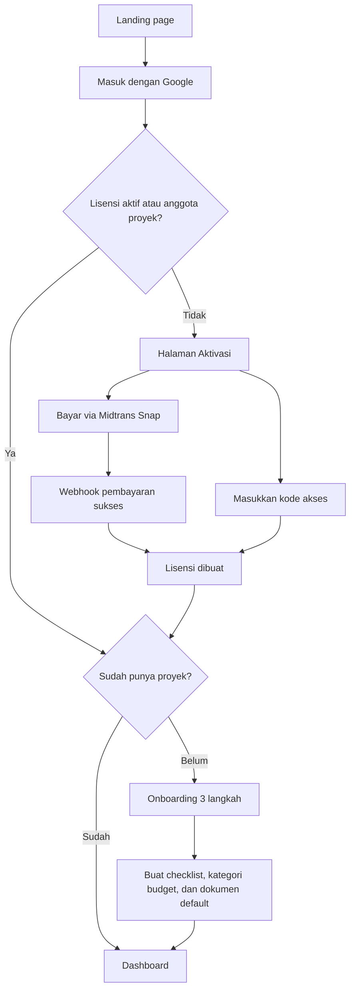
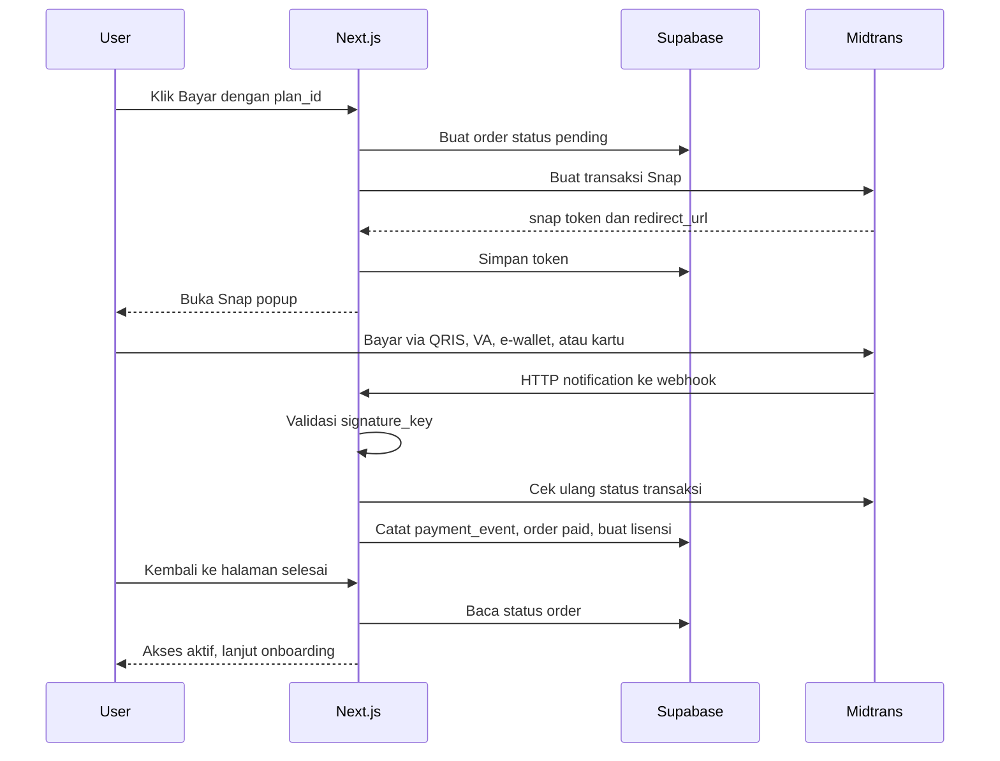
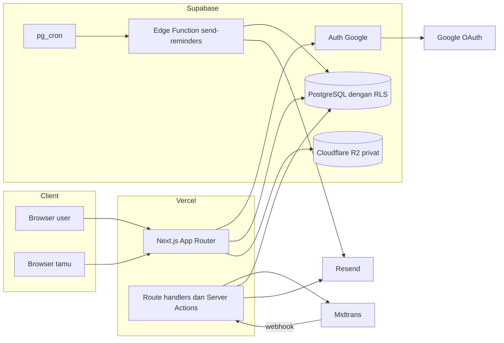

# PRD Monaplan: Digital Wedding Planner

| | |
|---|---|
| Versi | 1.0 (draft) |
| Tanggal | 9 Oktober 2026 |
| Pemilik produk | (isi nama kamu) |
| Dokumen terkait | `ERD.md`, `DESIGN.md` |

---

## 0. Keputusan dan asumsi awal

Bagian ini merangkum keputusan yang sudah diambil serta asumsi yang dipakai karena belum dikonfirmasi. Asumsi ditandai agar mudah diubah tanpa membongkar dokumen lain.

| Topik | Keputusan | Status |
|---|---|---|
| Nama produk | Monaplan (nama sementara). Prefix kode akses dan nomor order `MNP` ikut diganti saat nama final ditetapkan | Sementara |
| Tech stack | Next.js (App Router, TypeScript) + Supabase (PostgreSQL, Auth) + Cloudflare R2 (penyimpanan berkas) + Vercel | Final |
| Metode login | Google OAuth melalui Supabase Auth | Final |
| Aktivasi akun | Dua jalur: bayar via payment gateway, atau tebus kode akses dari admin | Final |
| Payment gateway | Midtrans Snap, dibungkus antarmuka `PaymentProvider` agar bisa diganti Xendit atau Tripay | Asumsi |
| Model harga | Dua jenis paket: **Selamanya** (sekali bayar) dan **Bermasa Aktif** (misal 12 bulan, bisa diperpanjang atau di-upgrade ke Selamanya). Satu lisensi untuk satu proyek pernikahan | Final |
| Kolaborasi | Owner bisa mengundang hingga 3 kolaborator (peran Editor atau Viewer) | Asumsi |
| Setelah masa aktif habis atau akses dicabut | Data tetap bisa dilihat dan diekspor (read-only), tidak bisa diubah | Asumsi |
| Bahasa dan format | Bahasa Indonesia, Rupiah tanpa desimal, zona waktu default Asia/Jakarta | Final |
| UI | Layout dashboard mengikuti referensi (sidebar, kartu KPI, grafik, tabel), palet monokromatik plum sesuai brand landing page | Final |

---

## 1. Ringkasan produk

Monaplan adalah aplikasi web wedding planner all-in-one untuk calon pengantin di Indonesia. Seluruh persiapan, mulai dari checklist, budget, vendor, tamu dan RSVP, rundown, mahar dan seserahan, dokumen, hingga pengingat, dikelola dari satu dashboard dan bisa dikerjakan bersama pasangan atau keluarga.

**Masalah.** Persiapan pernikahan biasanya tersebar di banyak tempat: spreadsheet budget, catatan di HP, chat vendor di WhatsApp, daftar tamu di Excel, dan screenshot bukti transfer di galeri. Akibatnya pembayaran vendor terlewat, angka budget tidak sinkron antara pasangan, dan RSVP sulit direkap.

**Solusi.** Satu ruang kerja per pernikahan yang modulnya saling terhubung. Vendor yang sudah deal otomatis masuk ke budget, jadwal DP dan pelunasan muncul di kalender, dan tamu menerima link RSVP pribadi yang hasilnya langsung terekap.

**Model bisnis.** Dua pilihan paket: sekali bayar untuk akses selamanya, atau paket bermasa aktif yang lebih murah dan bisa diperpanjang. User login dengan Google, lalu mengaktifkan akses dengan membayar melalui Midtrans atau memasukkan kode akses yang dibagikan admin (reseller, promo, bonus vendor, penjualan offline).

---

## 2. Tujuan dan metrik

### 2.1 Tujuan

1. Memberi calon pengantin satu sumber kebenaran untuk semua persiapan.
2. Mengubah pengunjung menjadi pembeli dengan alur aktivasi yang singkat: login, bayar atau tebus kode, langsung pakai.
3. Memberi admin kendali penuh atas distribusi akses melalui kode akses yang bisa dilacak.

### 2.2 Metrik keberhasilan (target awal, divalidasi setelah beta)

| Metrik | Definisi | Target 3 bulan |
|---|---|---|
| Activation rate | % user baru yang memiliki lisensi aktif dalam 7 hari setelah login pertama | 25% |
| Payment success rate | % order Midtrans yang berakhir `paid` | 60% |
| Onboarding completion | % akun aktif yang menyelesaikan Pengaturan Pernikahan dalam 24 jam | 80% |
| Weekly active projects | % proyek dengan minimal 1 perubahan data per minggu | 50% |
| Modul terpakai | Rata-rata jumlah modul yang dipakai per proyek di minggu ke-4 | 5 dari 11 |
| RSVP response rate | % tamu yang merespons dari tamu yang sudah dikirimi link | 60% |

---

## 3. Persona dan peran

| Persona | Deskripsi | Kebutuhan utama |
|---|---|---|
| Calon pengantin (Owner) | 23 sampai 33 tahun, mayoritas memakai HP, merencanakan 6 sampai 18 bulan sebelum hari H | Tahu apa yang harus dikerjakan, kontrol budget, rekap tamu tanpa ribet |
| Kolaborator | Pasangan, orang tua, saudara, atau WO yang diundang owner | Ikut mengisi dan memantau tanpa harus membeli akses sendiri |
| Tamu undangan | Tidak punya akun, menerima link via WhatsApp | Konfirmasi kehadiran dalam kurang dari 30 detik |
| Admin Monaplan | Pemilik bisnis | Membuat kode akses, memantau order dan lisensi, menangani kendala user |

Hak akses per peran dalam satu proyek pernikahan:

| Peran | Lihat data | Ubah data | Kelola kolaborator | Hapus proyek |
|---|---|---|---|---|
| Owner | Ya | Ya | Ya | Ya |
| Editor | Ya | Ya | Tidak | Tidak |
| Viewer | Ya | Tidak | Tidak | Tidak |

---

## 4. Ruang lingkup

### 4.1 MVP (rilis pertama)

- Login Google, halaman aktivasi, pembayaran Midtrans, penebusan kode akses
- Panel admin: paket, order, lisensi, batch kode akses, pengguna, log audit
- 11 modul sesuai halaman fitur: Dashboard, Pengaturan Pernikahan, Panduan Penggunaan, To Do Checklist, Budgeting, Kelola Vendor, Tamu & RSVP, Rundown Hari H, Mahar & Seserahan, Dokumen Penting, Reminder & Calendar
- Halaman RSVP publik per tamu dan pengiriman undangan via link WhatsApp (`wa.me`)
- Kolaborator via link undangan
- Notifikasi in-app dan email

### 4.2 Fase 2

- Halaman undangan digital dengan template
- Check-in tamu hari H dengan QR code
- Sinkronisasi Google Calendar dan feed `.ics`
- WhatsApp Business API untuk kirim massal otomatis
- PWA dan push notification
- Voucher diskon dan dashboard reseller

### 4.3 Di luar cakupan

- Marketplace vendor dan pemesanan vendor melalui aplikasi
- Pembayaran ke vendor melalui aplikasi
- Chat real-time antar kolaborator

---

## 5. Alur utama

### 5.1 Login dan aktivasi



Langkah rinci:

1. User klik "Masuk dengan Google" di landing page atau `/login`.
2. Supabase Auth mengarahkan ke Google, lalu kembali ke `/auth/callback`. Trigger database membuat baris `profiles` saat user pertama kali terdaftar.
3. Server mengecek lisensi aktif. Jika tidak ada dan user juga bukan anggota proyek mana pun, user diarahkan ke `/aktivasi`.
4. Di `/aktivasi`, user memilih: bayar, atau tebus kode akses.
5. Setelah lisensi aktif, user yang belum punya proyek masuk ke onboarding: (1) nama pasangan, (2) tanggal dan kota, (3) total budget dan perkiraan jumlah tamu. Semua bisa dilewati kecuali nama pasangan.
6. Selesai onboarding, sistem membuat checklist default (due date dihitung mundur dari tanggal pernikahan), kategori budget default, daftar dokumen administrasi default, dan template pesan WhatsApp, lalu membuka Dashboard.

### 5.2 Kolaborator bergabung

1. Owner membuka Pengaturan Pernikahan, bagian Kolaborator, memasukkan email dan peran. Sistem membuat link undangan (berlaku 7 hari) dan mengirim email.
2. Penerima membuka link dan login dengan Google. **Email akun Google harus sama dengan email undangan**, agar link yang diteruskan ke orang lain tidak bisa dipakai. Jika berbeda, tampil pesan dan opsi meminta owner mengundang ulang.
3. Kolaborator langsung masuk ke proyek tanpa membeli akses. Akses kolaborator mengikuti status lisensi owner.

### 5.3 Tamu mengisi RSVP

1. User memilih tamu, klik "Kirim via WhatsApp". Aplikasi membuka `https://wa.me/62xxxx?text=...` berisi pesan dari template dengan link `/rsvp/{token}` milik tamu tersebut, lalu menandai `invitation_sent_at`.
2. Tamu membuka link dan melihat nama pasangan, detail acara yang relevan untuk dirinya, serta form: Hadir, Tidak hadir, atau Masih ragu, jumlah orang (maksimal sesuai kuota undangan), dan ucapan.
3. Tamu bisa mengubah jawaban sampai batas waktu RSVP (default H-3, bisa diatur).
4. Rekap di modul Tamu & RSVP dan di Dashboard langsung terbarui.

---

## 6. Sistem akses dan lisensi

### 6.1 Konsep

| Entitas | Arti |
|---|---|
| Paket (`plans`) | Produk yang dijual: jenis (Selamanya atau Bermasa Aktif), durasi, harga, batas proyek, batas kolaborator, kuota penyimpanan |
| Order (`orders`) | Satu upaya pembelian paket melalui payment gateway |
| Kode akses (`access_codes`) | Kode yang dibuat admin, terikat ke satu paket, bisa dipakai sekali atau beberapa kali sesuai kuota |
| Lisensi (`licenses`) | Hak akses milik user. Dibuat dari order yang lunas, dari kode akses, atau diberikan manual oleh admin |

**Semua jalur aktivasi bermuara ke tabel `licenses`.** Seluruh pengecekan akses di aplikasi dan di database hanya membaca tabel ini, sehingga logikanya satu dan konsisten.

### 6.2 Aturan lisensi

Jenis paket:

| Jenis | Contoh | Masa aktif | Perpanjangan | Upgrade |
|---|---|---|---|---|
| Selamanya (`lifetime`) | Monaplan Selamanya | Tanpa batas | Tidak perlu | Tidak ada |
| Bermasa Aktif (`timed`) | Monaplan 12 Bulan | Sesuai `duration_days` | Beli atau tebus kode paket bermasa aktif lagi | Beli atau tebus kode paket Selamanya |

Harga dan durasi diatur admin per paket. Kode akses juga terikat ke salah satu paket, sehingga admin bisa membagikan kode Selamanya maupun kode Bermasa Aktif.

Aturan:

1. Lisensi aktif jika `status = active`, `starts_at <= now()`, dan `ends_at` kosong (Selamanya) atau masih di masa depan.
2. Akses proyek mengikuti lisensi owner. Kolaborator tidak membutuhkan lisensi sendiri.
3. **Perpanjangan tidak menghanguskan sisa hari.** Paket bermasa aktif yang dibeli saat lisensi masih berjalan dimulai dari tanggal berakhir lisensi terakhir.
4. **Upgrade ke Selamanya berlaku seketika.** Di MVP tidak ada potongan harga atas sisa hari paket lama (lihat pertanyaan terbuka).
5. User yang sudah punya akses Selamanya tidak bisa membeli paket apa pun atau menebus kode lain.
6. Jumlah proyek aktif yang boleh dibuat owner dibatasi `plans.max_projects` (default 1). Proyek yang diarsipkan tidak dihitung.
7. Saat masa aktif habis, semua anggota proyek tetap bisa melihat dan mengekspor data, tetapi tidak bisa menambah atau mengubah. Banner "Akses berakhir" tampil dengan tombol Perpanjang dan Upgrade ke Selamanya. Halaman RSVP publik tetap berjalan 30 hari setelah masa aktif habis agar tamu tidak terdampak.
8. Admin dapat mencabut lisensi (misalnya karena refund atau penyalahgunaan) dan memulihkannya. Lisensi yang dicabut langsung tidak berlaku dan halaman RSVP ditutup.
9. Pengingat masa aktif dikirim H-14 dan H-3 sebelum lisensi bermasa aktif berakhir. Paket Selamanya tidak menerima pengingat.
10. Semua lisensi diterbitkan lewat satu fungsi database (`issue_license`) yang mengunci data user, sehingga dua aktivasi bersamaan tidak saling menimpa.

### 6.3 Kode akses

| Aspek | Ketentuan |
|---|---|
| Format | `MNP-XXXX-XXXX-XXXX`, 12 karakter acak dari alfabet Crockford Base32 (tanpa I, L, O, U) sehingga tidak ada karakter yang mirip. Sekitar 60 bit entropi |
| Input | Tidak peka huruf besar kecil, spasi dan tanda hubung diabaikan, huruf O dibaca 0, huruf I atau L dibaca 1, prefix `MNP` boleh tidak diketik |
| Pembuatan | Admin membuat batch: nama, channel (reseller, promo, bonus, offline, kompensasi), paket, jumlah kode (maks 10.000 per batch), kuota pakai per kode (default 1), tanggal kedaluwarsa kode |
| Distribusi | Batch bisa diekspor ke CSV, satu kode juga bisa disalin langsung dari panel admin |
| Status | `available`, `redeemed` (kuota habis), `revoked`. Kedaluwarsa dihitung dari `valid_until` |
| Keamanan | Penebusan atomik di database dengan row lock. Batas 5 percobaan gagal per user dan per IP dalam 15 menit. Semua percobaan dicatat |
| Pelacakan | Admin bisa melihat siapa yang menebus kode, kapan, dan lisensi yang dihasilkan |

Kriteria penerimaan penebusan:

- Kode valid dan tersedia: lisensi dibuat, kuota kode berkurang, user diarahkan ke onboarding atau dashboard.
- Kode berkuota 1 ditebus dua user pada saat bersamaan: hanya satu yang berhasil.
- Setiap kegagalan mengembalikan kode error yang dipetakan ke pesan ramah (daftar pesan ada di `DESIGN.md` bagian Microcopy).

### 6.4 Penegakan akses berlapis

1. **Middleware atau proxy Next.js:** semua route di bawah `/w/*`, `/akun`, `/aktivasi`, dan `/admin` wajib login.
2. **Layout server proyek:** cek keanggotaan dan status lisensi owner. Tanpa keanggotaan, tampil 404. Lisensi habis atau dicabut, tampil mode read-only.
3. **Row Level Security Supabase:** baca butuh keanggotaan proyek, tulis butuh peran Owner atau Editor dan lisensi owner aktif. Lapisan ini tetap menjaga data walaupun ada bug di UI.

---

## 7. Pembayaran (Midtrans Snap)

### 7.1 Alur



### 7.2 Aturan teknis

- Harga selalu diambil dari tabel `plans` di server. Client hanya mengirim `plan_id`.
- Format `order_number`: `MNP-YYYYMMDD-XXXXXX` (6 karakter acak). Nilai ini dipakai sebagai `order_id` di Midtrans.
- Order kedaluwarsa 24 jam (dapat dikonfigurasi). Jika user klik bayar lagi saat order pending untuk paket yang sama masih berlaku, token lama dipakai ulang.
- Server key Midtrans hanya ada di server. Client key dipakai untuk memuat `snap.js`.
- Halaman aktivasi menyesuaikan kondisi user: belum aktif melihat kedua paket, pemilik paket bermasa aktif melihat opsi Perpanjang dan Upgrade ke Selamanya, pemilik akses Selamanya tidak bisa membuat order.
- Jika order sempat lunas padahal user sudah punya akses Selamanya (misal dua order dibayar bersamaan), order tetap dicatat lunas, ditandai `needs_review`, dan admin melakukan refund.
- Webhook `POST /api/webhooks/midtrans`:
  1. Validasi `signature_key = SHA512(order_id + status_code + gross_amount + ServerKey)` memakai nilai string persis seperti yang dikirim Midtrans.
  2. Cek ulang status ke API status Midtrans sebelum memberi akses.
  3. Simpan notifikasi ke `payment_events`. Kombinasi transaksi dan status bersifat unik, sehingga notifikasi ganda diabaikan.
  4. Cocokkan nominal dengan `orders.amount_idr`.
  5. Jika status final sukses, panggil fungsi database `grant_license_for_order` yang idempoten.
  6. Balas HTTP 200 setelah notifikasi tercatat agar Midtrans tidak terus mengulang.
- Halaman `/checkout/selesai` tidak pernah memberi akses. Halaman ini hanya membaca status order (polling tiap 3 detik, maksimal 2 menit), lalu mengarahkan user.

Pemetaan status:

| Status Midtrans | Kondisi | Status order | Aksi |
|---|---|---|---|
| `capture` | `fraud_status = accept` | `paid` | Buat lisensi |
| `capture` | `fraud_status = challenge` | `pending` | Tandai untuk ditinjau admin |
| `settlement` | | `paid` | Buat lisensi |
| `pending` | | `pending` | Tidak ada |
| `deny` | | `failed` | Tidak ada |
| `cancel` | | `cancelled` | Tidak ada |
| `expire` | | `expired` | Tidak ada |
| `refund` | | `refunded` | Cabut lisensi otomatis |
| `partial_refund` | | `paid` | Tandai untuk ditinjau admin |

### 7.3 Abstraksi provider

```ts
interface PaymentProvider {
  createCheckout(order: Order, customer: Customer): Promise<{ token: string; redirectUrl: string }>;
  verifyNotification(payload: unknown): Promise<VerifiedNotification>;
  getStatus(orderNumber: string): Promise<ProviderStatus>;
}
```

Implementasi pertama adalah `MidtransProvider`. Pindah ke Xendit cukup dengan implementasi baru dan endpoint webhook baru, tanpa mengubah tabel.

### 7.4 Setelah pembayaran

- Email kuitansi (Resend) berisi nomor order, paket, nominal, metode bayar, dan masa aktif (tanggal berakhir, atau keterangan Selamanya).
- Riwayat order dan kuitansi tersedia di `/akun/tagihan`.
- Ajukan aktivasi akun production Midtrans sejak awal pengembangan karena butuh proses verifikasi bisnis.

---

## 8. Kebutuhan fungsional per modul

Prioritas: **P0** wajib di MVP, **P1** diusahakan di MVP, **P2** fase berikutnya.

### 8.1 Dashboard

Tujuan: ringkasan seluruh persiapan dalam satu layar.

| ID | Kebutuhan | Prioritas |
|---|---|---|
| DSH-01 | Sapaan dengan nama pasangan dan tanggal hari ini | P0 |
| DSH-02 | Kartu hitung mundur hari H (hari tersisa, tanggal, lokasi utama) dengan aksi cepat Tambah Tugas dan Catat Pembayaran | P0 |
| DSH-03 | Kartu KPI: Budget terpakai (realisasi terhadap total), Tamu konfirmasi hadir (orang dan pax) | P0 |
| DSH-04 | Grafik pengeluaran per bulan atau per kategori, bisa diganti | P1 |
| DSH-05 | Progress per fase persiapan dalam mini card | P1 |
| DSH-06 | Target persiapan: progress checklist, pelunasan vendor, dokumen lengkap | P0 |
| DSH-07 | Tabel pembayaran vendor terdekat dengan status | P0 |
| DSH-08 | Agenda 14 hari ke depan (tugas, pembayaran, acara, agenda manual) | P0 |
| DSH-09 | Kartu status akses di sidebar sesuai kondisi: Selamanya (ajakan undang kolaborator), Bermasa Aktif (sisa hari, Perpanjang, Upgrade), atau belum aktif (ajakan aktivasi) | P0 |
| DSH-10 | Aktivitas terbaru kolaborator | P2 |

### 8.2 Pengaturan Pernikahan

| ID | Kebutuhan | Prioritas |
|---|---|---|
| SET-01 | Nama lengkap dan panggilan kedua mempelai, judul proyek (contoh "Raka & Nadia") | P0 |
| SET-02 | Tanggal pernikahan, kota, zona waktu (WIB, WITA, WIT) | P0 |
| SET-03 | Daftar acara: lamaran, pengajian, siraman, akad, pemberkatan, resepsi, ngunduh mantu, lainnya. Tiap acara punya waktu, nama tempat, alamat, link Google Maps, dress code | P0 |
| SET-04 | Total budget, target jumlah tamu, batas waktu RSVP | P0 |
| SET-05 | Foto sampul pasangan untuk halaman RSVP | P1 |
| SET-06 | Kelola kolaborator: undang, ubah peran, keluarkan | P0 |
| SET-07 | Ekspor seluruh data proyek (Excel per modul, ZIP dokumen) | P1 |
| SET-08 | Arsipkan atau hapus proyek dengan konfirmasi mengetik nama proyek | P1 |

Kriteria: mengubah tanggal pernikahan menawarkan opsi menggeser due date tugas yang berasal dari template dan belum selesai.

### 8.3 Panduan Penggunaan

| ID | Kebutuhan | Prioritas |
|---|---|---|
| PND-01 | Langkah berurutan: (1) Atur pernikahan, (2) Tentukan budget, (3) Rapikan checklist, (4) Catat vendor, (5) Masukkan daftar tamu, (6) Siapkan template WhatsApp, (7) Susun rundown, (8) Lengkapi dokumen | P0 |
| PND-02 | Tiap langkah punya penjelasan singkat, tombol menuju modul terkait, dan tanda selesai otomatis bila syaratnya terpenuhi (contoh: minimal 1 vendor tercatat) | P0 |
| PND-03 | Progress panduan tampil di Dashboard sampai semua langkah selesai | P1 |
| PND-04 | Konten panduan disimpan sebagai MDX di repo | P0 |
| PND-05 | Artikel tips per fase persiapan | P2 |

### 8.4 To Do Checklist

| ID | Kebutuhan | Prioritas |
|---|---|---|
| CHK-01 | Checklist default dari template, due date dihitung mundur dari tanggal pernikahan | P0 |
| CHK-02 | Pengelompokan per fase: lebih dari 12 bulan, 12 sampai 6 bulan, 6 sampai 3 bulan, 3 sampai 1 bulan, 1 bulan terakhir, minggu terakhir, hari H, setelah hari H | P0 |
| CHK-03 | CRUD tugas: judul, deskripsi, kategori, fase, due date, prioritas, penanggung jawab (anggota proyek), vendor terkait | P0 |
| CHK-04 | Status: belum, dikerjakan, selesai. Centang cepat dari daftar | P0 |
| CHK-05 | Filter fase, status, penanggung jawab, terlambat. Pencarian judul | P0 |
| CHK-06 | Urutkan ulang dengan drag and drop dalam satu fase | P1 |
| CHK-07 | Progress bar keseluruhan dan per fase | P0 |
| CHK-08 | Tugas terlambat diberi penanda dan masuk notifikasi | P0 |
| CHK-09 | Tampilan board per status | P2 |

### 8.5 Budgeting

| ID | Kebutuhan | Prioritas |
|---|---|---|
| BDG-01 | Kategori budget default (bisa diubah) dengan alokasi per kategori | P0 |
| BDG-02 | Item budget per kategori: nama, estimasi, realisasi (nilai deal), vendor terkait | P0 |
| BDG-03 | Jadwal pembayaran per item atau vendor: DP, termin, pelunasan, nominal, jatuh tempo, status, tanggal bayar, metode, bukti bayar | P0 |
| BDG-04 | Ringkasan: total budget, total estimasi, total realisasi, sudah dibayar, sisa tagihan, selisih terhadap budget | P0 |
| BDG-05 | Peringatan saat realisasi kategori melebihi alokasi | P0 |
| BDG-06 | Grafik estimasi terhadap realisasi per kategori | P1 |
| BDG-07 | Ekspor ke Excel | P1 |

Kriteria: nilai uang disimpan sebagai bilangan bulat Rupiah dan ditampilkan `Rp 12.500.000`. Input otomatis memformat ribuan saat diketik.

### 8.6 Kelola Vendor

| ID | Kebutuhan | Prioritas |
|---|---|---|
| VND-01 | Data vendor: kategori, nama, kontak person, nomor WhatsApp, email, Instagram, website, alamat, catatan, rating | P0 |
| VND-02 | Status pipeline: prospek, survei, negosiasi, deal, batal | P0 |
| VND-03 | Paket per vendor (nama, harga, isi paket) dan perbandingan paket antar vendor dalam satu kategori | P0 |
| VND-04 | Saat ditandai deal: pilih paket, isi nilai dan tanggal deal, sistem menawarkan membuat item budget dan jadwal DP serta pelunasan | P0 |
| VND-05 | Tombol chat WhatsApp langsung ke vendor | P0 |
| VND-06 | Tampilan tabel dan tampilan pipeline (kolom per status) | P1 |
| VND-07 | Halaman detail vendor: paket, pembayaran, dokumen (kontrak), tugas terkait | P0 |

### 8.7 Tamu & RSVP

| ID | Kebutuhan | Prioritas |
|---|---|---|
| GST-01 | CRUD tamu: nama, nomor WhatsApp, pihak (pria, wanita, bersama), grup, kategori (VIP, reguler), kuota pax, acara yang diundang, catatan | P0 |
| GST-02 | Impor dari CSV atau Excel dengan pratinjau dan deteksi duplikat nomor | P0 |
| GST-03 | Normalisasi nomor: `08xx`, `+62`, `62` menjadi `62xxxx` | P0 |
| GST-04 | Template pesan WhatsApp dengan placeholder `{nama_tamu}`, `{nama_pasangan}`, `{detail_acara}`, `{link_rsvp}` dan pratinjau | P0 |
| GST-05 | Tombol kirim per tamu membuka WhatsApp dengan pesan terisi, lalu menandai "sudah dikirim" | P0 |
| GST-06 | Mode kirim berurutan: setelah satu terkirim, langsung lanjut ke tamu berikutnya yang belum dikirimi | P1 |
| GST-07 | Halaman RSVP publik per tamu tanpa login, mobile-first | P0 |
| GST-08 | Rekap: total undangan, total pax, hadir, tidak hadir, ragu, belum merespons, daftar ucapan | P0 |
| GST-09 | Filter dan aksi massal: ubah grup, hapus, tandai terkirim | P0 |
| GST-10 | Ekspor daftar tamu dan hasil RSVP ke Excel | P1 |
| GST-11 | Batas waktu RSVP yang bisa diatur | P1 |
| GST-12 | Check-in hari H dengan QR | P2 |

Template pesan default:

```
Halo {nama_tamu},

Dengan penuh rasa syukur, kami {nama_pasangan} bermaksud mengundang Bapak/Ibu/Saudara/i untuk hadir di hari bahagia kami.

{detail_acara}

Mohon kesediaannya mengonfirmasi kehadiran melalui tautan berikut:
{link_rsvp}

Terima kasih atas doa dan restunya.
```

### 8.8 Rundown Hari H

| ID | Kebutuhan | Prioritas |
|---|---|---|
| RDN-01 | Rundown per acara (akad, resepsi, dan lainnya) | P0 |
| RDN-02 | Item: jam mulai, jam selesai, kegiatan, deskripsi, PIC, lokasi, vendor terkait | P0 |
| RDN-03 | Urut otomatis berdasarkan jam, drag and drop untuk item dengan jam sama | P1 |
| RDN-04 | Deteksi jadwal yang bertabrakan | P1 |
| RDN-05 | Tampilan cetak dan ekspor PDF untuk keluarga dan vendor | P1 |
| RDN-06 | Mulai dari contoh rundown akad atau resepsi | P1 |

### 8.9 Mahar & Seserahan

| ID | Kebutuhan | Prioritas |
|---|---|---|
| MHR-01 | Dua tab: Mahar dan Seserahan | P0 |
| MHR-02 | Item: nama, kategori, jumlah, estimasi harga, harga beli, link toko, nama toko, foto, status (rencana, dipesan, dibeli, diterima), catatan | P0 |
| MHR-03 | Ringkasan total estimasi, total dibeli, progres pembelian | P0 |
| MHR-04 | Opsi menghubungkan item ke budget kategori "Mahar & Seserahan" | P1 |

### 8.10 Dokumen Penting

| ID | Kebutuhan | Prioritas |
|---|---|---|
| DOC-01 | Checklist administrasi per pihak (pria dan wanita) dengan daftar default yang bisa diubah | P0 |
| DOC-02 | Unggah file PDF, JPG, PNG, WEBP (maks 10 MB per file) ke penyimpanan privat, dengan kategori: identitas, administrasi nikah, kontrak vendor, bukti pembayaran, lainnya | P0 |
| DOC-03 | Tautkan dokumen ke item checklist administrasi, vendor, atau pembayaran | P0 |
| DOC-04 | Pratinjau dan unduh lewat signed URL berumur pendek | P0 |
| DOC-05 | Kuota penyimpanan per paket (default 500 MB) | P1 |

Daftar default bersifat umum (KTP, KK, akta kelahiran, pas foto, surat pengantar RT/RW dan kelurahan, surat izin orang tua bila diperlukan) dan selalu disertai catatan bahwa persyaratan perlu disesuaikan dengan KUA atau Dukcapil setempat.

### 8.11 Reminder & Calendar

| ID | Kebutuhan | Prioritas |
|---|---|---|
| CAL-01 | Kalender gabungan: due date tugas, jatuh tempo pembayaran vendor, acara pernikahan, agenda manual | P0 |
| CAL-02 | Tampilan bulan, minggu, dan daftar agenda (default di HP) | P0 |
| CAL-03 | Agenda manual: judul, waktu, sepanjang hari, catatan, pengingat (misal 1 hari dan 1 jam sebelumnya) | P0 |
| CAL-04 | Pengingat otomatis tugas (H-3, H-0) dan pembayaran (H-7, H-1) | P0 |
| CAL-05 | Kanal notifikasi in-app dan email, preferensi per user | P0 |
| CAL-06 | Feed `.ics` dan sinkron Google Calendar | P2 |

### 8.12 Akun

| ID | Kebutuhan | Prioritas |
|---|---|---|
| ACC-01 | Profil: nama, foto dari Google, nomor HP opsional | P0 |
| ACC-02 | Status lisensi, jenis paket, tanggal mulai dan berakhir (atau Selamanya), sisa hari, riwayat aktivasi | P0 |
| ACC-03 | Riwayat order dan kuitansi | P0 |
| ACC-04 | Preferensi notifikasi | P1 |
| ACC-05 | Hapus akun dan data pribadi | P1 |

### 8.13 Panel Admin (`/admin`)

| ID | Kebutuhan | Prioritas |
|---|---|---|
| ADM-01 | Ringkasan: pendapatan, order per status, lisensi aktif, kode tertebus per batch | P0 |
| ADM-02 | Paket: buat paket Selamanya atau Bermasa Aktif, ubah harga, durasi, dan batas, aktifkan atau nonaktifkan | P0 |
| ADM-03 | Batch kode akses: buat, lihat kode, ekspor CSV, cabut per kode atau per batch | P0 |
| ADM-04 | Order: cari, filter status, lihat event pembayaran mentah, cek ulang status ke Midtrans | P0 |
| ADM-05 | Lisensi: beri manual (paket apa pun), perpanjang, cabut dengan alasan, pulihkan | P0 |
| ADM-06 | Pengguna: cari email, lihat lisensi dan daftar proyek (tanpa membuka isi data proyek) | P0 |
| ADM-07 | Log audit untuk semua aksi admin | P0 |

---

## 9. Notifikasi

| Pemicu | Waktu | Penerima | Kanal |
|---|---|---|---|
| Tugas jatuh tempo | H-3 dan H-0 pukul 08.00 waktu proyek | Penanggung jawab, atau owner bila kosong | In-app, email |
| Tugas terlambat | Ringkasan harian | Owner dan editor | In-app |
| Pembayaran vendor | H-7 dan H-1 | Owner dan editor | In-app, email |
| Agenda manual | Sesuai pengaturan pengingat | Pembuat agenda | In-app, email |
| RSVP baru | Ringkasan harian pukul 19.00 | Owner | In-app, email |
| Undangan kolaborator | Saat dibuat | Email tujuan | Email |
| Pembayaran sukses | Saat lunas | Pembeli | Email |
| Akses akan berakhir (khusus paket Bermasa Aktif) | H-14 dan H-3 | Owner | In-app, email |
| Akses telah berakhir | Hari H berakhir | Owner | In-app, email |

Penjadwal: Supabase `pg_cron` memanggil Edge Function `send-reminders` tiap 15 menit. Setiap notifikasi punya `dedupe_key` unik sehingga tidak terkirim dua kali.

---

## 10. Kebutuhan non-fungsional

**Keamanan**
- RLS aktif di semua tabel skema `public`. Secret key Supabase hanya dipakai di server (webhook, cron, admin).
- Validasi input dengan Zod di setiap server action dan route handler.
- Rate limit di endpoint sensitif: tebus kode, RSVP publik, checkout.
- Token RSVP dan undangan kolaborator acak (minimal 72 bit) dan bisa dicabut.
- Bucket penyimpanan privat, akses lewat signed URL.
- Header keamanan (CSP, HSTS) dan cookie sesi httpOnly melalui `@supabase/ssr`.

**Privasi (UU No. 27 Tahun 2022 tentang Pelindungan Data Pribadi)**
- Kebijakan privasi dan syarat layanan, persetujuan saat login pertama.
- Data tamu (nama dan nomor HP) hanya dipakai untuk keperluan undangan.
- User bisa mengekspor dan menghapus datanya. Admin tidak membuka isi proyek tanpa izin.

**Kinerja**
- LCP Dashboard di bawah 2,5 detik pada jaringan 4G.
- Daftar tamu sampai 2.000 baris tetap lancar (paginasi atau virtualisasi).
- Vercel dan Supabase di region Singapura untuk latensi terbaik ke Indonesia.

**Responsif dan aksesibilitas**
- Mobile-first, didukung mulai lebar 360 px.
- Kontras teks minimal WCAG AA, navigasi keyboard, label form lengkap.

**Lokalisasi**
- Bahasa Indonesia dengan sapaan "kamu".
- `Intl.NumberFormat('id-ID')` untuk angka, `date-fns` locale `id` untuk tanggal.
- Waktu disimpan sebagai `timestamptz` (UTC) dan ditampilkan sesuai zona waktu proyek.

**Keandalan dan observabilitas**
- Backup harian Supabase, Point in Time Recovery bila paket mendukung.
- Sentry untuk error. Seluruh notifikasi pembayaran tersimpan di `payment_events`.

---

## 11. Arsitektur teknis

### 11.1 Stack

| Lapisan | Pilihan |
|---|---|
| Framework | Next.js App Router, TypeScript, React Server Components, Server Actions |
| UI | Tailwind CSS, shadcn/ui (Radix), Lucide icons, Recharts |
| Form dan validasi | React Hook Form + Zod |
| Data di client | TanStack Query untuk modul interaktif (tamu, checklist), selebihnya RSC |
| Auth | Supabase Auth (Google OAuth) + `@supabase/ssr` |
| Database | Supabase PostgreSQL, RLS, fungsi SQL, `pg_cron` |
| Storage | Cloudflare R2, bucket privat (S3-compatible). Unggah lewat presigned PUT, unduh lewat presigned GET berumur pendek. Supabase Storage bucket `project-files` sebagai cadangan bila kredensial R2 kosong |
| Pembayaran | Midtrans Snap |
| Email | Resend + React Email |
| Utilitas | date-fns, papaparse dan exceljs (impor dan ekspor), dnd-kit (drag and drop) |
| Monitoring | Sentry, PostHog (opsional) |
| Hosting | Vercel dan Supabase, region Singapura |
| Tooling | Supabase CLI (migrasi, generate types), ESLint, Prettier, Vitest, Playwright |

### 11.2 Diagram arsitektur



### 11.3 Peta route

| Route | Akses | Keterangan |
|---|---|---|
| `/` | Publik | Landing page |
| `/login` | Publik | Masuk dengan Google |
| `/auth/callback` | Publik | Menukar code OAuth menjadi sesi |
| `/aktivasi` | Login | Beli paket atau tebus kode |
| `/checkout/selesai` | Login | Menunggu konfirmasi pembayaran |
| `/onboarding` | Login + lisensi | Membuat proyek pertama |
| `/w/[projectId]` | Anggota | Dashboard |
| `/w/[projectId]/checklist` | Anggota | To Do Checklist |
| `/w/[projectId]/budget` | Anggota | Budgeting |
| `/w/[projectId]/vendor`, `/w/[projectId]/vendor/[vendorId]` | Anggota | Kelola Vendor |
| `/w/[projectId]/tamu` | Anggota | Tamu & RSVP |
| `/w/[projectId]/rundown` | Anggota | Rundown Hari H |
| `/w/[projectId]/mahar-seserahan` | Anggota | Mahar & Seserahan |
| `/w/[projectId]/dokumen` | Anggota | Dokumen Penting |
| `/w/[projectId]/kalender` | Anggota | Reminder & Calendar |
| `/w/[projectId]/pengaturan` | Anggota, sebagian khusus owner | Pengaturan Pernikahan |
| `/w/[projectId]/panduan` | Anggota | Panduan Penggunaan |
| `/akun`, `/akun/tagihan` | Login | Profil, lisensi, kuitansi |
| `/gabung/[token]` | Login | Menerima undangan kolaborator |
| `/rsvp/[token]` | Publik | Form RSVP tamu |
| `/admin/*` | Admin | Panel admin |
| `POST /api/checkout` | Login | Membuat order dan token Snap |
| `POST /api/access-code/redeem` | Login | Menebus kode akses |
| `POST /api/rsvp/[token]` | Publik | Menyimpan RSVP |
| `POST /api/webhooks/midtrans` | Midtrans | Notifikasi pembayaran |

### 11.4 Struktur folder

```
src/
  app/
    (marketing)/page.tsx
    (auth)/login/page.tsx
    auth/callback/route.ts
    aktivasi/  checkout/selesai/  onboarding/
    w/[projectId]/
      layout.tsx                cek keanggotaan dan lisensi
      page.tsx                  dashboard
      checklist/ budget/ vendor/ tamu/ rundown/
      mahar-seserahan/ dokumen/ kalender/ pengaturan/ panduan/
    rsvp/[token]/  gabung/[token]/
    admin/
    api/checkout/  api/access-code/redeem/  api/rsvp/[token]/  api/webhooks/midtrans/
  components/
    ui/                         komponen shadcn
    app/                        shell, sidebar, stat card, dsb.
  features/<modul>/             actions.ts, queries.ts, schema.ts, components/
  lib/
    supabase/                   server.ts, client.ts, admin.ts
    payments/                   provider.ts, midtrans.ts
    format/                     currency.ts, date.ts, phone.ts
  content/panduan/*.mdx
supabase/
  migrations/
  functions/send-reminders/
  seed.sql
```

### 11.5 Environment variables

```
NEXT_PUBLIC_APP_URL=
NEXT_PUBLIC_SUPABASE_URL=
NEXT_PUBLIC_SUPABASE_PUBLISHABLE_KEY=     # atau anon key, tergantung jenis key project
SUPABASE_SECRET_KEY=                      # atau service role key, hanya di server
MIDTRANS_SERVER_KEY=
NEXT_PUBLIC_MIDTRANS_CLIENT_KEY=
MIDTRANS_IS_PRODUCTION=false
RESEND_API_KEY=
EMAIL_FROM="Monaplan <halo@domainkamu.com>"
SENTRY_DSN=
GOOGLE_SITE_VERIFICATION=                 # opsional, kode verifikasi Google Search Console
```

`NEXT_PUBLIC_APP_URL` wajib diisi domain produksi (misal `https://monaplan.id`) karena dipakai sebagai dasar URL kanonis, sitemap, dan gambar Open Graph (lihat bagian 16).

---

## 12. Event analytics

| Event | Properti |
|---|---|
| `login_succeeded` | `is_new_user` |
| `activation_viewed` | `source` |
| `checkout_started` | `plan_code`, `amount` |
| `payment_succeeded` | `plan_code`, `payment_method` |
| `access_code_redeemed` | `batch_channel`, `plan_code` |
| `access_code_failed` | `reason` |
| `onboarding_completed` | `has_wedding_date`, `has_budget` |
| `task_completed` | `phase_key`, `from_template` |
| `vendor_marked_deal` | `category` |
| `guests_imported` | `count`, `duplicates` |
| `whatsapp_invite_opened` | `mode` (tunggal atau berurutan) |
| `rsvp_submitted` | `status`, `pax` |
| `collaborator_invited` / `collaborator_joined` | `role` |

---

## 13. Rencana rilis

Estimasi untuk 1 sampai 2 developer full-stack.

| Fase | Durasi | Lingkup |
|---|---|---|
| 0. Fondasi | Minggu 1 | Repo, project Supabase, skema dan RLS, Google OAuth, design token, app shell |
| 1. Aktivasi | Minggu 2 sampai 3 | Paket, halaman aktivasi, Midtrans sandbox, tebus kode, panel admin dasar, email |
| 2. Modul inti | Minggu 4 sampai 6 | Onboarding, Pengaturan, Checklist, Budgeting, Vendor, Dashboard |
| 3. Modul hari H | Minggu 7 sampai 8 | Tamu & RSVP, Rundown, Mahar & Seserahan, Dokumen, Kalender & Reminder, kolaborator |
| 4. Peluncuran | Minggu 9 sampai 10 | Panduan, QA, uji RLS otomatis, beta tertutup dengan kode akses, Midtrans production, go-live |

---

## 14. Risiko dan mitigasi

| Risiko | Dampak | Mitigasi |
|---|---|---|
| Kebocoran data antar proyek | Tinggi | RLS di setiap tabel, `project_id` wajib di semua tabel proyek, uji otomatis untuk setiap policy |
| Kode akses disebar atau ditebak | Sedang | Entropi tinggi, rate limit, kuota per kode, pencabutan per kode atau batch |
| Webhook palsu atau ganda | Tinggi | Validasi signature, cek ulang status, idempotensi di database |
| Nomor WhatsApp diblokir karena kirim massal | Sedang | MVP memakai `wa.me` yang dikirim manual oleh user dari HP-nya sendiri |
| Aktivasi Midtrans production lama | Sedang | Ajukan sejak minggu pertama, gunakan kode akses untuk beta |
| Mayoritas user memakai HP | Sedang | Desain mobile-first, uji di Android kelas menengah |
| Paket Selamanya menanggung biaya server tanpa pendapatan berulang | Sedang | Harga Selamanya jauh di atas paket bermasa aktif, kuota penyimpanan per paket, kompres gambar saat unggah, satu proyek per lisensi, pantau biaya per user aktif |
| User bingung memilih paket | Rendah | Halaman aktivasi menampilkan dua kartu berdampingan dengan perbandingan singkat, paket Selamanya diberi label "Paling hemat jangka panjang" |

---

## 15. Pertanyaan terbuka

1. Berapa durasi dan harga final tiap paket? Contoh di seed: 12 bulan Rp99.000 dan Selamanya Rp199.000. Perlukah lebih dari satu durasi (misal 6 dan 12 bulan)?
2. Saat upgrade dari paket bermasa aktif ke Selamanya, apakah sisa hari diberi potongan harga, atau cukup harga Selamanya penuh?
3. Jika pasangan ingin membuat proyek kedua (misal untuk saudara), apakah perlu membeli lisensi baru atau ada paket khusus?
4. Perlukah faktur dengan data pajak untuk pembeli korporat atau WO?
5. Apakah reseller perlu dashboard sendiri untuk memantau kode yang mereka jual?
6. Domain dan alamat email pengirim yang akan dipakai?

---

## 16. SEO

Tujuan SEO hanya untuk halaman publik (landing, masuk/daftar, kebijakan privasi). Seluruh data pernikahan bersifat privat dan **tidak boleh** muncul di mesin pencari.

### 16.1 Peta indeks

| Route | Indeks | Mekanisme |
|---|---|---|
| `/` | Ya, prioritas 1.0 | Sitemap, kanonis `/` |
| `/login` | Ya, prioritas 0.4 | Sitemap, kanonis `/login` |
| `/privasi` | Ya, prioritas 0.2 | Sitemap, kanonis `/privasi` |
| `/w/*`, `/admin/*`, `/akun/*` | Tidak | `robots.txt` Disallow, header `X-Robots-Tag: noindex, nofollow`, meta `robots` noindex di layout |
| `/rsvp/[token]`, `/gabung/[token]` | Tidak | Sama seperti di atas. Token tidak boleh terindeks walau link tersebar di WhatsApp |
| `/aktivasi`, `/onboarding`, `/checkout/*`, `/mulai`, `/lupa-password`, `/reset-password` | Tidak | Sama seperti di atas |
| `/auth/*`, `/api/*` | Tidak | `robots.txt` Disallow dan `X-Robots-Tag` |

Tiga lapis noindex dipakai sekaligus karena `robots.txt` hanya mencegah perayapan, bukan pengindeksan URL yang ditautkan dari luar.

### 16.2 Metadata

| Elemen | Ketentuan |
|---|---|
| `metadataBase` | Dari `NEXT_PUBLIC_APP_URL`, sehingga semua URL kanonis dan Open Graph absolut |
| Title | Landing: "Monaplan: Aplikasi Wedding Planner Digital untuk Calon Pengantin". Halaman lain memakai template `%s · Monaplan` |
| Description | 140 sampai 160 karakter, memuat kata kunci utama, unik per halaman publik |
| Canonical | Setiap halaman publik punya `alternates.canonical` |
| Open Graph | `og:title`, `og:description`, `og:url`, `og:locale = id_ID`, `og:type = website`, gambar 1200 x 630 |
| Twitter | `summary_large_image` |
| Bahasa | `<html lang="id">`, `inLanguage: id-ID` di data terstruktur |
| Verifikasi | `GOOGLE_SITE_VERIFICATION` menjadi meta `google-site-verification` bila diisi |

### 16.3 Kata kunci target

wedding planner, aplikasi wedding planner, checklist persiapan pernikahan, budget pernikahan, daftar tamu pernikahan, RSVP online, undangan WhatsApp, rundown pernikahan, mahar dan seserahan, dokumen nikah KUA, persiapan nikah.

Kata kunci dipakai secara alami di judul, deskripsi, H1, H2, dan teks fitur, bukan ditumpuk.

### 16.4 Struktur konten landing page

- Tepat satu `<h1>` (hero). Setiap section memakai `<h2>` dengan `aria-labelledby`, item di dalamnya `<h3>`.
- Urutan section: Hero, Fitur (11 modul), Cara memulai (3 langkah), Harga paket (dari tabel `plans`), FAQ, Footer.
- Landmark semantik: `<header>`, `<nav aria-label>`, `<main>`, `<section>`, `<footer>`. Daftar fitur dan langkah memakai `<ul>` atau `<ol>`.
- Ikon dekoratif diberi `aria-hidden`.

### 16.5 Data terstruktur (JSON-LD)

Satu blok `@graph` di landing page berisi:

| Tipe | Isi |
|---|---|
| `Organization` | Nama, URL, logo |
| `WebSite` | URL, nama, bahasa, publisher |
| `SoftwareApplication` | Kategori `LifestyleApplication`, OS `Web`, daftar fitur, `Offer` per paket aktif (harga IDR dari tabel `plans`) |
| `FAQPage` | Enam pertanyaan dan jawaban yang sama persis dengan section FAQ yang terlihat di halaman |

Harga di JSON-LD selalu mengikuti tabel `plans`, sehingga tidak pernah berbeda dari harga yang tampil.

### 16.6 Berkas SEO teknis

| Berkas | Fungsi |
|---|---|
| `src/lib/seo.ts` | Konfigurasi terpusat: nama situs, judul, deskripsi, kata kunci, daftar path privat, helper `pageMetadata` dan `jsonLd` |
| `src/app/robots.ts` | `robots.txt` dengan Disallow untuk path privat dan tautan sitemap |
| `src/app/sitemap.ts` | `sitemap.xml` berisi halaman publik saja |
| `src/app/manifest.ts` | Web app manifest (nama, warna tema `#8C3A63`, ikon) |
| `src/app/opengraph-image.tsx` | Gambar pratinjau 1200 x 630 yang dibuat otomatis |
| `src/app/icon.tsx`, `src/app/apple-icon.tsx` | Favicon dan ikon Apple |
| `next.config.ts` | Header `X-Robots-Tag` untuk path privat |

### 16.7 Kinerja dan pengalaman

Core Web Vitals ikut memengaruhi peringkat. Targetnya mengikuti bagian 10: LCP di bawah 2,5 detik pada 4G. Font dimuat lewat `next/font` dengan `display: swap`, dan gambar dari penyimpanan memakai lazy load.

### 16.8 Checklist sebelum peluncuran

1. `NEXT_PUBLIC_APP_URL` berisi domain produksi dengan `https`.
2. Daftarkan domain di Google Search Console, isi `GOOGLE_SITE_VERIFICATION`, lalu kirim `https://domain/sitemap.xml`.
3. Uji landing page di Rich Results Test (FAQ dan SoftwareApplication terbaca).
4. Uji pratinjau tautan di WhatsApp dan Facebook Sharing Debugger.
5. Pastikan `/w/...` dan `/rsvp/...` mengembalikan header `X-Robots-Tag: noindex`.

### 16.9 Fase 2

- Halaman artikel tips per fase persiapan (PND-05) sebagai konten SEO, masing-masing dengan `Article` JSON-LD dan masuk sitemap.
- Halaman undangan digital publik (fase 2) bersifat opt-in per proyek dan tetap noindex secara default.

## 17. Trial, promo, akses selamanya, dan integrasi (revisi)

### 17.1 Akses selamanya
- Paket yang dijual hanya **Selamanya** (sekali bayar). Paket bermasa aktif tidak lagi dijual dan tombol Perpanjang dihapus; lisensi bermasa aktif lama tetap berlaku sampai habis.
- Satu-satunya akses sementara adalah **trial**.
- Admin mengubah **peran** (user/admin) dan **akses** per pengguna dari Admin > Pengguna: beri selamanya, beri trial N hari, cabut (wajib alasan), pulihkan. Admin tidak bisa mengubah peran dirinya sendiri. Semua perubahan masuk log audit.

### 17.2 Trial
- Admin menyalakan/mematikan trial dan mengatur lamanya (1 sampai 90 hari) di Admin > Konfigurasi > Trial.
- Saat aktif, akun yang belum pernah punya lisensi apa pun otomatis mendapat trial ketika pertama masuk (`/mulai`), langsung ke onboarding tanpa melewati halaman pembayaran. Satu kali per akun.
- Landing page menampilkan lencana dan tombol "Coba Gratis N Hari"; tab Daftar menampilkan catatan yang sama. Semuanya hilang saat trial dimatikan.
- Setelah trial habis, ruang kerja menjadi baca-saja, data tidak dihapus, dan pengguna ditawari akses selamanya. Lama trial yang diubah hanya berlaku untuk trial berikutnya.
- Batasan: trial per akun, bukan per orang.

### 17.3 Promo
- Admin > Konfigurasi > Promo: saklar fitur, daftar promo (persen atau nominal, per paket atau semua paket, jendela tanggal, aktif/nonaktif).
- Harga akhir selalu dihitung di server. Bila beberapa promo berlaku, potongan terbesar dipakai. Harga tidak turun di bawah Rp 1.000.
- **Sinkron dengan Midtrans**: order menyimpan harga asli, potongan, dan nama promo; Snap menerima baris paket dan baris diskon bernilai negatif sehingga halaman bayar menampilkan rincian yang sama. `amount_idr` adalah nominal akhir yang dicocokkan dengan webhook. Promo yang diatur di dashboard Midtrans (mis. promo bank) terpisah dan tidak dikelola dari sini.

### 17.4 Konfigurasi di sidebar admin
Grup **Konfigurasi** berisi Paket, Trial, dan Promo.

### 17.5 Google Calendar
- Pengguna menghubungkan akun Google dari Reminder & Calendar. Monaplan membuat kalender sekunder "Monaplan · {judul proyek}" dan menyinkronkan tugas berjatuh tempo, pembayaran belum lunas, acara pernikahan, dan agenda (termasuk pengingat).
- Satu arah (Monaplan ke Google), scope `calendar.app.created` saja sehingga kalender pribadi pengguna tidak dapat dibaca. Sinkron otomatis setiap data berubah, ada tombol Sinkronkan sekarang, Hentikan, dan Putuskan (mencabut izin di Google).
- Token disimpan terenkripsi (AES-256-GCM) dan hanya bisa dibaca server.

### 17.6 Mobile
Di layar kecil navigasi berada di bilah tab bawah (4 tujuan utama + Menu) untuk workspace, akun, dan admin. Menu membuka bottom sheet berisi semua modul, kartu akses, tema, dan keluar.

## 18. Revisi gelombang B: rute, kuota, email, bantuan, bahasa

- **Rute**: ruang kerja berada di `/app/<slug>/...`. Slug dibuat otomatis dari nama panggilan pasangan, unik, dan bisa diubah pemilik. `/w/<uuid>` dan `/w/<slug>` dialihkan permanen ke rute baru.
- **Berkas**: kuota 50 MB per pengguna (semua proyek miliknya dijumlah, unggahan kolaborator dihitung ke pemilik), maksimal 5 MB per berkas. Berkas disajikan lewat Cloudflare Worker di domain sendiri dengan token bertanda tangan; bucket R2 tetap privat. Kunci berkas: `{storage_prefix}/{folder}/{nama}-{id}.{ext}`.
- **Rundown PDF**: dibuat di server (`@react-pdf/renderer`) dengan tata letak dokumen formal A4: judul, identitas acara, tabel bergaris, nomor halaman, kolom tanda tangan.
- **Pengingat**: email lewat Resend dari `/api/cron/reminders` (dilindungi `CRON_SECRET`, dipanggil pg_cron). Template bertipe dua bahasa; pratinjau dan kirim tes di `/admin/email`.
- **Bantuan**: halaman `/app/<slug>/bantuan` (FAQ, ulangi tur, formulir ke `support_tickets`); kotak masuk di `/admin/bantuan`. Product tour mencakup seluruh halaman pengguna dan admin.
- **Tingkat paket**: paket lifetime punya `tier`. Upgrade membayar selisih: harga tier tujuan (setelah promo) dikurangi kredit dari pembayaran sebelumnya, minimal Rp 1.000. Lisensi lama menjadi `superseded`. Kode akses dan pemberian admin tidak memberi kredit.
- **Bahasa**: Indonesia dan Inggris dengan pengalih bahasa (cookie `mp-lang`, `profiles.language`). Konten buatan pengguna dan nama paket di database tidak diterjemahkan; PDF rundown tetap berbahasa Indonesia.
- **Performa dan animasi**: sesi lewat `getClaims()`, query paralel, `loading.tsx` skeleton, transisi halaman CSS yang menghormati `prefers-reduced-motion`.

## 19. Revisi gelombang C

- Kode promo bebas diketik admin, dengan periode berlaku dan popup promo dari bawah layar.
- Aktivasi ditata ulang (tombol Keluar, dua kartu kode berdampingan).
- Tombol bantuan menjadi menu: tur halaman, pusat bantuan, WhatsApp admin.
- Lima tema RSVP gratis (Adat Luxury, Klasik Emas, Minimal Modern, Floral Romantis, Rustic Natural).
- Rundown PDF polos tanpa kop dan tanda tangan. Admin bisa menghapus lisensi yang dicabut.
- Dashboard admin dengan grafik. Notifikasi RSVP langsung dan pencarian lintas modul.

## 20. Bonus dan landing

- Dua modul bonus: Rona Impian (papan inspirasi) dan Honeymoon Planner. Nilai pemasaran Rp30.000 dan Rp55.000 diatur di `src/content/bonus.ts`.
- Landing dirancang ulang: sebelum-sesudah, peta jalan dengan jumlah tugas nyata, bento fitur, tiket bonus dan nota nilai, tab peran, harga satu paket ("Dapatkan Sekarang") atau banyak paket ("Pilih paket ini").
